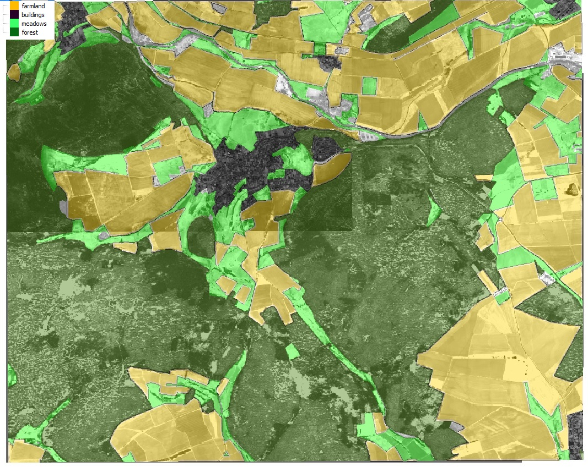
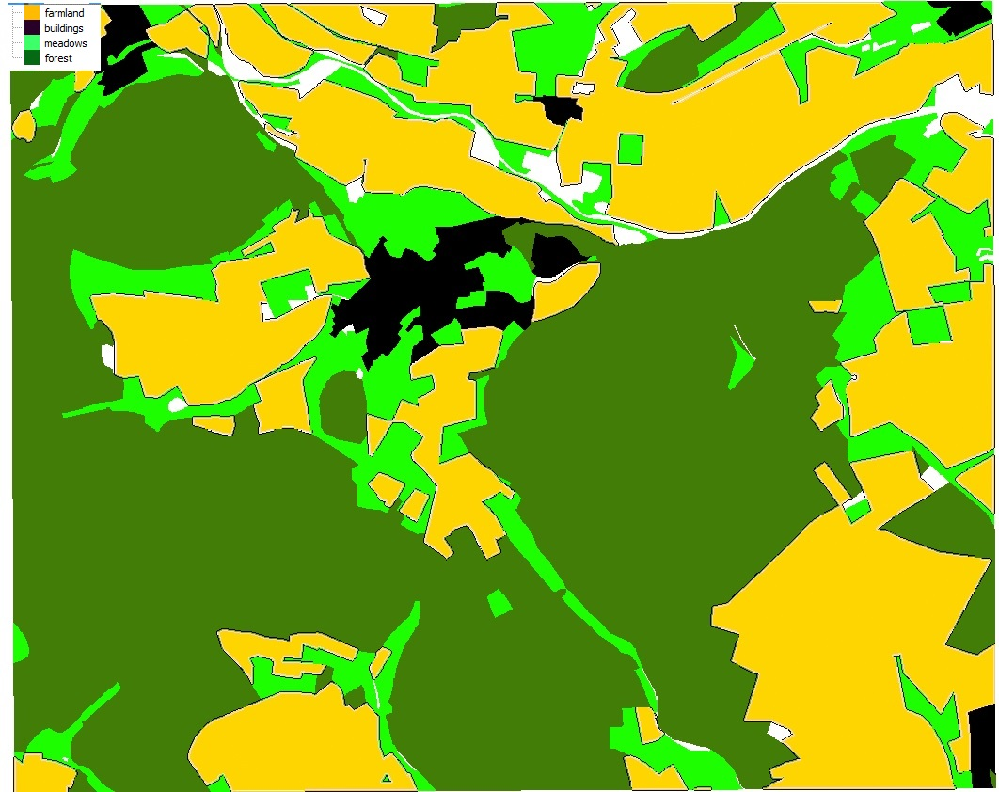

```{r setup, include=FALSE}
knitr::opts_chunk$set(echo = TRUE)
```

###GIS warm up

##problems
- the only problem that appeared concerning the projection, was to decide witch of both pseudo mercator projections offered by Qgis is the right one
- how to identify any classes
- the Grass-Gis reclass tool is not very intuitive
- we had trouble merging the rasterfiles optained from the ATKIS-classification in qgis

##solving strategies

We found out that EPSG:6871 is deprecated (https://epsg.io/6871). We used the ATKIS DLM25 as a baseline and cropped the intensity-raster by the different landuse classifications (forest, settlement, meadows, farmland). We reclassified the values of the cropped raster layers by right mouseclick on properties and saved them as new files.We merged all raster layers in R and displayed them in distinct colours. 


##landuse with lidar-raster in the background



##only landuse



