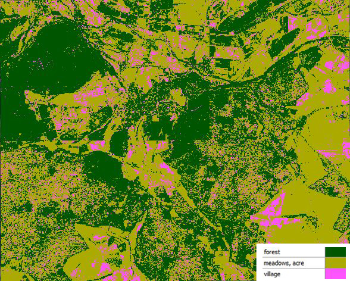

```{r setup, include=FALSE}
knitr::opts_chunk$set(echo = TRUE)
```

###GIS warm up

##problems
- the only problem that appeared concerning the projection, was to decide witch of both pseudo mercator projections offered by Qgis is the right one
- how to identify any classes
- no spectral information available and Lidar-Intensity-Data don't seem to be very useful for undertaking a landuse-classification
- we had trouble merging the rasterfiles obtained from the ATKIS-classification in qgis

####solving strategies

We found out that EPSG:6871 is deprecated (https://epsg.io/6871). After using the Semi-Automatic-Classification-Plugin (SCP) to make an attempt of undertaking a landuse-classification (which failed due to the unavailability of spectral information and the use of Lidar-Intensity-Data as can be seen in image 1), we used the ATKIS DLM25 as a baseline and cropped the intensity-raster by the different landuse classifications (forest, settlement, meadows, farmland). We temporary reclassified the values of the cropped raster layers by right mouseclick on properties.We merged all raster layers in R and displayed them in distinct colours. 

####1: landuse-classification attempt with SCP



####2: landuse with lidar-raster in the background


##3: only landuse


