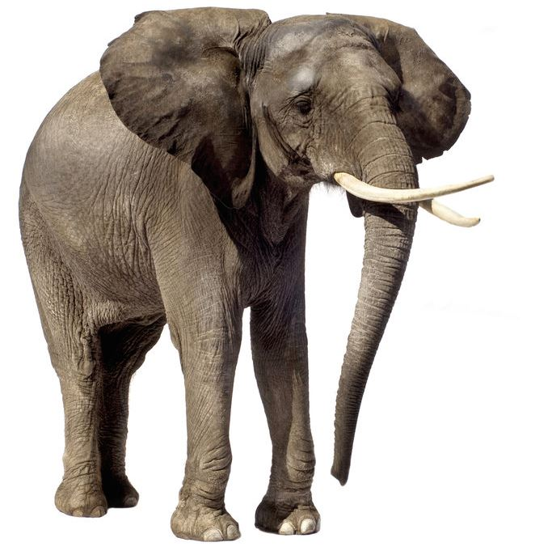

```{r setup, include=FALSE}
knitr::opts_chunk$set(echo = TRUE)
```

## Deconstruction work

The fact that geographers have been racking their brains for decades to adequately distinguish the diversity of landforms already suggests that this is not a trivial task. To translate these descriptions into the language of a machine and further into the language of raster cells does not seem easy neither. Broken down to the most superficial level, the value of a raster cell can be related to the surrounding cells in three different ways- more, equal ore less. Two different objects of the same type of geomorphological structure should express similar patterns in the relations of the raster cells and therefore could be recognized by an algorithm.
For example:
```{r }
peak<-matrix(c(-1,-1,-1,-1,0,-1,-1,-1,-1), nrow=3, ncol=3, byrow=TRUE)
peak
slope<-matrix(c(1,1,1,0,0,0,-1,-1,-1), nrow=3, ncol=3, byrow=TRUE)
slope
valley<-matrix(c(1,0,1,1,0,1,1,0,1), nrow=3, ncol=3, byrow=TRUE)
valley

```

But to try to capture the diversity of landforms in such a simplified way would be like to distinguish the diversity of animals by the count of theire legs.

###animal_1 has four legs=mammal


###animal_2 has four legs = mammal = animal_1


###four legs=mammal?


###What we did

So it is more than a pattern and there is also something like the scale that matters.
That is why it still needs a human to define the conditions when an entity is part of a landform category.

We involved both, the recognition of a pattern such as the expression of conditions in the development of our algorithm. A cell belongs to the category "plain" if the variance of the surrounding raster cells is below a certain threshhold, multiple cells form the entity "plain" if the total area of connected cells is above a certain threshhold and finaly, the distinction of the categories "plateau" and plain depends on the height of the entity. All threshholds are relativ to the value distribution of the investigated subsection of the world. 

##Flow Chart


##Algorithm R


```{r, eval=FALSE}
library(raster)

setwd("C:/Users/Jannis/Documents/GitHub/msc_phygeo_class_of_2016/gis_2016/data/raster")

r<-raster("DEM.tif")

###calculate the variance of a 3x3 focal window
r_focal<-focal(r, matrix(1,3,3), fun=var, pad = T, padValue = 0 )

###reclassify raster cells
m<-c(0,quantile(r_focal, .1), 1, quantile(r_focal, .1), quantile(r_focal, 1), 2)

rclmat<-matrix(m, ncol=3, byrow=TRUE)

rc<-reclassify(r_focal, rclmat)

### calculate area of connected raster cells
pol<-rasterToPolygons(rc, dissolve=TRUE)

pol_sep<-disaggregate(pol)

proj4string(pol_sep) <- CRS("+init=epsg:32632")

pol_sep$area<-area(pol_sep)


###rasterize
r_area<-rasterize(pol_sep,r, field="area" )

###decide wther it is a plain or a plateau

plains<-r

for (i in seq(c(r, r_area))){if(r[i]<quantile(r, 0.5) & r_area[i]>quantile(r_area, 0.5)) {plains[i]<-1}
  else if (r[i]>quantile(r, 0.5) & r_area[i]>quantile(r_area, 0.5)) {plains[i]<-2}
  }

```
