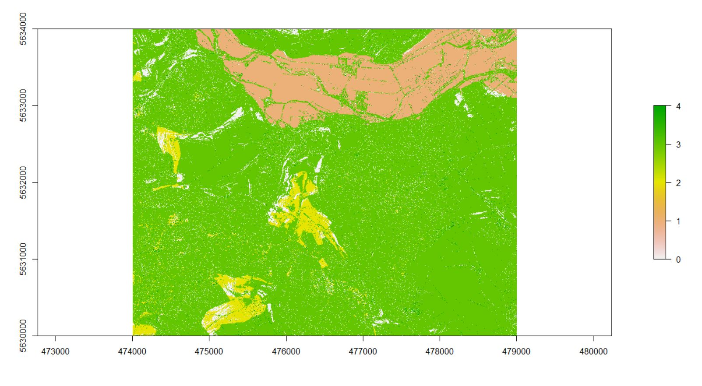

```{r setup, include=FALSE}
knitr::opts_chunk$set(echo = TRUE)
```

## Plains and Plateaus reloaded

Same workflow as 03-1 but with a nicer design. We adujsted the scale dependent thresholds of the fuzzy landform classifier to our highly resoluted data to have more homogenous results than last time.
```{r eval=FALSE}
##Fuzzy lanform element classification and algorithm 
#to seperate Plains from Plateaus

library(raster)
library(rgeos)
library(rgdal)
##path to directories
source("GitHub/msc_phygeo_class_of_2016/gis_2016/data/rdata/path_gis.R")

##path to saga and OSGeo shells
source("GitHub/msc_phygeo_class_of_2016/gis_2016/data/rdata/shells.R")


###gdal translate
cmd1<-paste0(OSGeo, " gdal_translate -of SAGA -ot Float32 ",
            gisrs_ba, "elevation.tif ", gisrs_trans, "elevation.sdat")

system(cmd1)


###calculate inputs forr fuzzy landform element classifier by using the saga modul "Slope, Aspect, Curvature"and the saga shell within osgeos4w


cmd2<-paste0(saga2, " ta_morphometry 0 ", 
             "-ELEVATION ",gisrs_trans, "elevation.sgrd",
             " -METHOD 6 -UNIT_SLOPE 1 -UNIT_ASPECT 1",
             " -SLOPE ", gisrs_sgpc, "slope_new.sgrd ", 
             " -ASPECT ", gisrs_sgpc, "aspect_new.sgrd ", 
             " -C_GENE ", gisrs_sgpc, "gc_new.sgrd ", 
             " -C_PROF ", gisrs_sgpc , "proC_new.sgrd ",
             " -C_TANG ", gisrs_sgpc , "tang_c.sgrd",
             " -C_MINI ", gisrs_sgpc, "min_c_new.sgrd ",
             " -C_MAXI ", gisrs_sgpc, "max_c_new.sgrd")


system(cmd2)

###calculate fuzzy landform elements. Since we have a exceptional high resolution default thresholds have to be changed

cmd3<-paste0(saga2, " ta_morphometry 25 ", 
             "-SLOPE ", gisrs_sgpc, "slope_new.sgrd",
             " -MINCURV ", gisrs_sgpc, "min_c_new.sgrd",
             " -MAXCURV ", gisrs_sgpc, "max_c_new.sgrd",
             " -PCURV ", gisrs_sgpc , "proC_new.sgrd",
             " -TCURV ", gisrs_sgpc , "tang_c.sgrd",
             " -PLAIN ", gisrs_mo, "plain_new.sgrd",
             " -FORM ", gisrs_mo, "form_new.sgrd",
             " -MEM ", gisrs_mo, "mem_new.sgrd",
             " -ENTROPY ", gisrs_mo, "entropy_new.sgrd",
             " -CI ", gisrs_mo, "ci_new.sgrd",
             " -SLOPETODEG 0 -T_SLOPE_MIN 5.000000 -T_SLOPE_MAX 15.000000",
             " -T_CURVE_MIN 0.000002 -T_CURVE_MAX 0.2")

system(cmd3)


###translate landforms this time with io_gdal

cmd4<-paste0(saga2, " io_gdal 2",
            " -GRIDS ", gisrs_mo, "form_new.sgrd",
            " -FILE ",gisrs_trans, "landform_new.tif" )

system(cmd4)


###Old Version: visual control of the output showed a heterogenous value distribution. We applied focal statistics (mean) to smooth the distrbution of values.


# fuzz<-raster(paste0(gisrs_trans, "landform_new.tif"))
# 
# fuzz_focal<-focal(fuzz, matrix(1,5,5), fun=mean, pad = T, padValue = 0 )
# 


###reclassification of the landform output according to the code in the function 

##(https://sourceforge.net/p/saga-gis/code/ci/master/tree/saga-gis/src/tools/terrain_analysis/ta_morphometry/fuzzy_landform_elements.cpp#l132)


###New Version: After changing the threshold values, the classification got much better.No more smoothing neccessary

fuzz<-raster(paste0(gisrs_trans, "landform_new.tif"))
m<-c(0, 99, 3, 99, 101 , 1, 101, 122, 4)

fuzzm<-matrix(m, ncol=3, byrow=TRUE)

fuzz_rc<-reclassify(fuzz, fuzzm)


writeRaster(fuzz_rc, paste0(gisres,  "fuzz_rc.tif"), bylayer=TRUE, overwrite=TRUE)


### calculate area of connected raster cells by conversion into polygons and reconversion into raster

##we stopped to polygonize the raster with rasterTopolygons from the raster package after two days without any results and decided to use the gdal_polygonize function. It was done after two minutes!

cmd5<-paste0(OSGeo, " gdal_polygonize ", gisres, "fuzz_rc.tif", " -f", paste(' "',  "ESRI Shapefile",'" ' , sep=""),  gisshp, "fuzz_rcn.shp" ) 
 
system(cmd5)


pol<-shapefile(paste0(gisshp, layer="fuzz_rcn"))

pol_sep<-disaggregate(pol)

##calculate area
pol_sep$area<-area(pol_sep)

shapefile(pol_sep, filename=paste0(gisshp, "area.shp"), overwrite=TRUE)

##rasterize polygon

cmd6<-paste0(OSGeo, " gdal_rasterize ", 
             "-a area -ot Float32 -of GTiff -te 474000.0 5630000.0 479000.0 5634000.0",
             " -tr 1 1 -co COMPRESS=DEFLATE -co PREDICTOR=1 -co ZLEVEL=6 -l area ",
             gisshp, "area.shp ", gisrs_ba, "area.tif")

system(cmd6)


##get variables for algorithm
ras_area<-raster(paste0(gisrs_ba, "area.tif"))
projection(ras_area)<-"+proj=utm +zone=32 +datum=WGS84 +units=m +no_defs +ellps=WGS84 +towgs84=0,0,0" 
DEM<-raster(paste0(gisrs_ba, "elevation.tif"))


### looping with several conditions over 20000000 raster cells takes forever!
for(i in seq(DEM)){if(DEM[i]>220 & fuzz_rc[i]==1) {fuzz_rc[i]<-2}}

## parallel processing on 4 cores still takes forever!

install.packages("doParallel")
library(doParallel)

cl <- makeCluster(4)  
registerDoParallel(cl) 

foreach(i=1:20000000)%dopar%{if(DEM[i]>220 & fuzz_rc[i]==1) {fuzz_rc[i]<-2}}


##### so why not straight forward

plot(fuzz_rc)
hist(ras_area)
hist(DEM)
plot(ras_area)

fuzz_rc[fuzz_rc==1 & ras_area>30000 & DEM>300]<-2
fuzz_rc[fuzz_rc==1 &DEM>225]<-3

### takes a few seconds :)

writeRaster(fuzz_rc, paste0(gisres, "plains_plateaus.tif"), bylayer=TRUE, overwrite=TRUE)
```



#Red: Plain
#Yellow: Plateau
#Green: Rest
