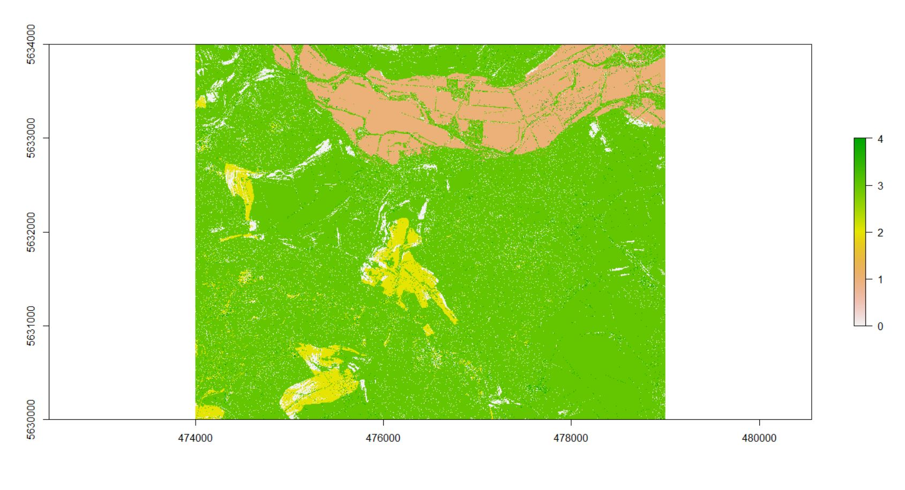

```{r setup, include=FALSE}
knitr::opts_chunk$set(echo = TRUE)
```

## Fuzzy lanform element classification and algorithm to seperate Plains from Plateaus by the help of different Filters


```{r eval=FALSE}
library(raster)

library(rgeos)

library(rgdal)

# path to directories

source("GitHub/data/gis/data/rdata/path_gis.R")

# path to saga and OSGeo shells

source("GitHub/data/gis/data/rdata/shells.R")

```

#### Filter on elevation to smooth the heterogenity of the final output


```{r eval=FALSE}
# get elevation tif

el<-raster(paste0(gisrs_ba, ("elevation.tif")))

# focal window
el_focal<-focal(el, w=matrix(1/25, 5,5))

writeRaster(el_focal, paste0(gisrs_ba, "el_focal.tif"))
```

#### Calculate inputs with filtered elevation

```{r eval=FALSE}

# first translate filtered elevation tif to saga format

cmd1<-paste0(OSGeo, " gdal_translate -of SAGA -ot Float32 ",
             gisrs_ba, "el_focal.tif ", gisrs_trans, "el_focal.sdat")

system(cmd1)

# than calculate inputs
cmd2<-paste0(saga2, " ta_morphometry 0 ", 
             "-ELEVATION ",gisrs_trans, "el_focal.sgrd",
             " -METHOD 6 -UNIT_SLOPE 1 -UNIT_ASPECT 1",
             " -SLOPE ", gisrs_sgpc, "slope_new.sgrd", 
             " -ASPECT ", gisrs_sgpc, "aspect_new.sgrd", 
             " -C_GENE ", gisrs_sgpc, "gc_new.sgrd", 
             " -C_PROF ", gisrs_sgpc , "proC_new.sgrd",
             " -C_TANG ", gisrs_sgpc , "tang_c.sgrd",
             " -C_MINI ", gisrs_sgpc, "min_c_new.sgrd",
             " -C_MAXI ", gisrs_sgpc, "max_c_new.sgrd")


system(cmd2)


```

#### Calculate Inputs with unfiltered elevation

```{r eval=FALSE}

# first translate elevation tif to saga format
cmd1<-paste0(OSGeo, " gdal_translate -of SAGA -ot Float32 ",
             gisrs_ba, "elevation.tif ", gisrs_trans, "elevation.sdat")

system(cmd1)


###calculate inputs forr fuzzy landform element classifier by using 
#the saga modul "Slope, Aspect, Curvature"and the saga shell within 
#osgeos4w


cmd2<-paste0(saga2, " ta_morphometry 0 ", 
             "-ELEVATION ",gisrs_trans, "elevation.sgrd",
             " -METHOD 6 -UNIT_SLOPE 1 -UNIT_ASPECT 1",
             " -SLOPE ", gisrs_sgpc, "slope_new.sgrd", 
             " -ASPECT ", gisrs_sgpc, "aspect_new.sgrd", 
             " -C_GENE ", gisrs_sgpc, "gc_new.sgrd", 
             " -C_PROF ", gisrs_sgpc , "proC_new.sgrd",
             " -C_TANG ", gisrs_sgpc , "tang_c.sgrd",
             " -C_MINI ", gisrs_sgpc, "min_c_new.sgrd",
             " -C_MAXI ", gisrs_sgpc, "max_c_new.sgrd")


system(cmd2)
```

#### Calculate Fuzzy Landforms with products of filtered elevation and adjusted thresholds. Than translate back to GEOTiff

```{r eval=FALSE}

# fuzzy landforms
cmd3<-paste0(saga2, " ta_morphometry 25 ", 
             "-SLOPE ", gisrs_sgpc, "slope_new.sgrd",
             " -MINCURV ", gisrs_sgpc, "min_c_new.sgrd",
             " -MAXCURV ", gisrs_sgpc, "max_c_new.sgrd",
             " -PCURV ", gisrs_sgpc , "proC_new.sgrd",
             " -TCURV ", gisrs_sgpc , "tang_c.sgrd",
             " -PLAIN ", gisrs_sgpc, "plain_new.sgrd",
             " -FORM ", gisrs_sgpc, "form_new.sgrd",
             " -MEM ", gisrs_sgpc, "mem_new.sgrd",
             " -ENTROPY ", gisrs_sgpc, "entropy_new.sgrd",
             " -CI ", gisrs_sgpc, "ci_new.sgrd",
             " -SLOPETODEG 0 -T_SLOPE_MIN 5.000000 -T_SLOPE_MAX 15.000000",
             " -T_CURVE_MIN 0.000002 -T_CURVE_MAX 0.2")

system(cmd3)


#translate landforms this time with io_gdal

cmd4<-paste0(saga2, " io_gdal 2",
             " -GRIDS ", gisrs_sgpc, "form_new.sgrd",
             " -FILE ",gisrs_sgpc, "landform_mean.tif" )

system(cmd4)


```

#### Calculate fuzzy landforms with product of unfiltered elevation. Than translate back to GEOTiff.

```{r eval=FALSE}

#fuzzy landforms
cmd3<-paste0(saga2, " ta_morphometry 25 ", 
             "-SLOPE ", gisrs_sgpc, "slope_new.sgrd",
             " -MINCURV ", gisrs_sgpc, "min_c_new.sgrd",
             " -MAXCURV ", gisrs_sgpc, "max_c_new.sgrd",
             " -PCURV ", gisrs_sgpc , "proC_new.sgrd",
             " -TCURV ", gisrs_sgpc , "tang_c.sgrd",
             " -PLAIN ", gisrs_sgpc, "plain_new.sgrd",
             " -FORM ", gisrs_sgpc, "form_new.sgrd",
             " -MEM ", gisrs_sgpc, "mem_new.sgrd",
             " -ENTROPY ", gisrs_sgpc, "entropy_new.sgrd",
             " -CI ", gisrs_sgpc, "ci_new.sgrd",
             " -SLOPETODEG 0 -T_SLOPE_MIN 5.000000 -T_SLOPE_MAX 15.000000",
             " -T_CURVE_MIN 0.000002 -T_CURVE_MAX 0.2")

system(cmd3)


#translate landforms this time with io_gdal

cmd4<-paste0(saga2, " io_gdal 2",
             " -GRIDS ", gisrs_sgpc, "form_new.sgrd",
             " -FILE ",gisrs_sgpc, "landform_modal.tif" )

system(cmd4)

```

####reclassification of landforms based on filtered elevation according to the code in this fuction:
(https://sourceforge.net/p/saga-gis/code/ci/master/tree/saga-gis/src/tools/terrain_analysis/ta_morphometry/fuzzy_landform_elements.cpp#l132)

```{r eval =FALSE}
#
fuzz<-raster(paste0(gisrs_sgpc, "landform_mean.tif"))

m<-c(0, 99, 3, 99, 101 , 1, 101, 122, 4)

fuzzm<-matrix(m, ncol=3, byrow=TRUE)

fuzz_rc<-reclassify(fuzz, fuzzm)

writeRaster(fuzz_rc, paste0(gisres,  "fuzz_rc_mean.tif"), bylayer=TRUE, overwrite=TRUE)


```

####reclassification of landforms based on unfiltered elevation according to the code in this fuction:
(https://sourceforge.net/p/saga-gis/code/ci/master/tree/saga-gis/src/tools/terrain_analysis/ta_morphometry/fuzzy_landform_elements.cpp#l132)

```{r eval=FALSE}
fuzz<-raster(paste0(gisrs_sgpc, "landform_modal.tif"))

m<-c(0, 99, 3, 99, 101 , 1, 101, 122, 4)

fuzzm<-matrix(m, ncol=3, byrow=TRUE)

fuzz_rc<-reclassify(fuzz, fuzzm)

writeRaster(fuzz_rc, paste0(gisres,  "fuzz_rc_modal.tif"), bylayer=TRUE, overwrite=TRUE)

```

##Size matters! WITH or without filter

```{r eval=FALSE}
#polygonize
cmd5<-paste0(OSGeo, " gdal_polygonize.bat ", gisres, "fuzz_rc_mean.tif", " -f", paste(' "',  "ESRI Shapefile",'" ' , sep=""),  
             gisshp, "fuzz_rc_mean.shp" ) 
system(cmd5)

pol<-shapefile(paste0(gisshp, layer="fuzz_rc_mean.shp"))

#diaggregate
pol_sep<-disaggregate(pol)

#calculate area
pol_sep$area<-area(pol_sep)

shapefile(pol_sep, filename=paste0(gisshp, "area_mean.shp"), overwrite=TRUE)

#rasterize polygon

cmd6<-paste0(OSGeo, " gdal_rasterize ", 
             "-a area -ot Float32 -of GTiff -te 474000.0 5630000.0 479000.0 5634000.0",
             " -tr 1 1 -co COMPRESS=DEFLATE -co PREDICTOR=1 -co ZLEVEL=6 -l area ",
             gisshp, "area_mean.shp ", gisrs_ba, "area_mean.tif")

system(cmd6)


```

##Size matters! With or WITHOUT filter!

```{r eval=FALSE}

#polygonize
cmd5<-paste0(OSGeo, " gdal_polygonize.bat ", gisres, "fuzz_rc_modal.tif", " -f", paste(' "',  "ESRI Shapefile",'" ' , sep=""),
             gisshp, "fuzz_rc_modal.shp" )

system(cmd5)

pol<-shapefile(paste0(gisshp, "fuzz_rc_modal.shp"))

#disaggregate

pol_sep<-disaggregate(pol)

#calculate area

pol_sep$area<-area(pol_sep)

shapefile(pol_sep, filename=paste0(gisshp, "area_modal.shp"), overwrite=TRUE)

#rasterize polygon

cmd6<-paste0(OSGeo, " gdal_rasterize ",
             "-a area -ot Float32 -of GTiff -te 474000.0 5630000.0 479000.0 5634000.0",
             " -tr 1 1 -co COMPRESS=DEFLATE -co PREDICTOR=1 -co ZLEVEL=6 -l area ",
             gisshp, "area_modal.shp ", gisrs_ba, "area_modal.tif")

system(cmd6)

```

####get variables for reclassification: WITH FILTERED ELEVATION

```{r eval=FALSE}

#reclassified TIFF
fuzz_rc_mean<-raster(paste0(gisres,  "fuzz_rc_mean.tif"))

#rasterized area
area<-raster(paste0(gisrs_ba, "area_mean.tif"))

projection(area)<-"+proj=utm +zone=32 +datum=WGS84 +units=m +no_defs +ellps=WGS84 +towgs84=0,0,0" 

#elevation
el<-raster(paste0(gisrs_ba, ("elevation.tif")))

````

####get variables for reclassification: WITHOUT FILTERED ELEVATION

```{r eval=FALSE}

#reclassified TIFF
fuzz_rc_modal<-raster(paste0(gisres,  "fuzz_rc_modal.tif"))

#rasterized area
area<-raster(paste0(gisrs_ba, "area_modal.tif"))
projection(area)<-"+proj=utm +zone=32 +datum=WGS84 +units=m +no_defs +ellps=WGS84 +towgs84=0,0,0" 

#elevation
el<-raster(paste0(gisrs_ba, ("elevation.tif")))

```

####reclassification based on certain conditions: WITH FITERED ELEVATION

```{r eval=FALSE}

#check on distributions of variable values

hist(area)

hist(el)

#reclassify

fuzz_rc_mean[fuzz_rc_mean==1 & area>30000 &el>250]<-2

plot(fuzz_rc_mean)

fuzz_rc_mean[el>225 &area<5000]<-3


fuzz_rc_mean[el>225 & fuzz_rc_mean==1 &fuzz_rc_mean!=2]<-3

plot(fuzz_rc_mean)

````

####reclassification based on certain conditions: WITHOUT FITERED ELEVATION

```{r eval=FALSE}

#check on distributions of variable values

hist(area)

hist(el)

#reclassify
fuzz_rc_modal[fuzz_rc_modal==1 & area>30000 &el>250]<-2

plot(fuzz_rc_modal)

fuzz_rc_modal[el>225 &area<5000]<-3


fuzz_rc_modal[el>225 & fuzz_rc_modal==1 &fuzz_rc_mean!=2]<-3

plot(fuzz_rc_modal)

```


##Filter based on the most frequent value in the neighbouring cells

```{r eval=FALSE}

#Filter
fuzz_rc_modal_final<-focal(fuzz_rc_modal, w=matrix(1,15,15), fun=modal)

plot(fuzz_rc_modal_final)

writeRaster(fuzz_rc_modal_final, paste0(gisres, "plains_plateaus_modal.tif"), bylayer=TRUE, overwrite=TRUE)

```


##let´s have a look
###mean


#####brown=PLAIN yellow=PLATEAU green=REST


###modal


#####brown=PLAIN bright green=PLATEAU green=REST


##Result

#####To apply the modal filter on the outcome of the reclassification process is obviously better suited to homogenize the final product, than to apply the mean filter on the input elevation tiff
