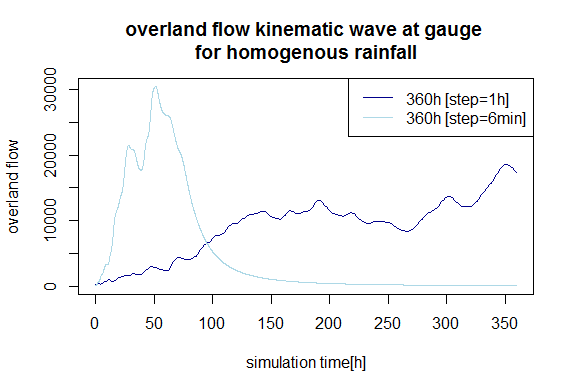

##OVERLAND FLOW

```{r, eval=FALSE}
#settings
source("C:/Users/mleza/Documents/msc-phygeo-ws-16/msc-phygeo-class-of-2016-MLezamaValdes/fun/paths.r")
inpath <- paste0(path_data_gis, "input_6_1/") #Tabelle und gefülltes DEM dort, 
#nach erstem Tool auch .shp mit gauges
outpath <- paste0(path_data_gis, "output/")
dem <- paste0(path_gis_input_clean,"elevation.tif")
sagaCmd <- paste0(path_saga_norm, "saga_cmd.exe")

#Tool "Convert table to points"
system(paste0(sagaCmd, " shapes_points 0",
                              " -TABLE=",inpath, "gauges.txt",
                              " -POINTS=",inpath,"gauges.shp",
              " -X=X", 
              " -Y=Y")
)

#dem already filled with Wang&Liu, if not dem.tif needs to be converted to 
#dem.sdat, then ta_preprocessor 4 to fill sinks.

system(paste0(sagaCmd, " sim_hydrology 1",
              " -DEM=",inpath, "dem_filled.sgrd",
              " -GAUGES=",inpath,"gauges.shp",
              " -FLOW=", outpath, "flow_grid_360_1.sgrd",
              " -GAUGES_FLOW=", outpath, "flow_gauges_360_1.txt",
              " -TIME_SPAN", 360, #15 days of rain
              " -TIME_STEP", 1,
              " -ROUGHNESS", 0.3, #default-no information
              " -PRECIP", 0) #homogenous
)

system(paste0(sagaCmd, " sim_hydrology 1",
              " -DEM=",inpath, "dem_filled.sgrd",
              " -GAUGES=",inpath,"gauges.shp",
              " -FLOW=", outpath, "flow_grid_360_0_1.sgrd",
              " -GAUGES_FLOW=", outpath, "flow_gauges_360_0_1.txt",
              " -TIME_SPAN", 360, #15 days of rain
              " -TIME_STEP", 0.1,
              " -ROUGHNESS", 0.3, #default-no information
              " -PRECIP", 0) #homogenous
)

#read tables of results
t360_1 <- read.table(paste0(outpath, "flow_gauges_360_1.txt"), header=T)
t360_0_1 <- read.table(paste0(outpath, "flow_gauges_360_0_1.txt"), header=T)

#360h (15 Tage) Vergleich TIME_STEP=1 mit =0.1
plot(t360_1$TIME, t360_1$GAUGE_01, type="l", col="darkblue", ylim=c(0,30430.0), 
     main="overland flow kinematic wave at gauge, \nhomogenous rainfall", xlab="time[h]", ylab="overland flow")
lines(t360_0_1$TIME, t360_0_1$GAUGE_01, type="l", col="lightblue")
legend("topright", legend=c("360h [step=1h]","360h [step=6min]"), lty=c(1,1), col=c("darkblue", "lightblue"))

```




###rainfall per grid cell used:
Even after intense reading of the paper by Johnson and Miller provided with the module info, google searches and attempts to read the source code the rainfall input stays obscure to 
us. 

###influence of selected time-step
As can be seen in the chart the runoff seems to be simulated in the 
expected manner for continuous homogenous rainfall in case of a 
time-step of 1 hour. In case of 0.1 hours - i.e. 6 minutes - after rising steeply the curve is falling likewise after about 60 h of simulation time as if rainfall would have stopped by then. The quantity of homogenous rainfall might have been assumed by the programmer for the time-step (which is more probable in view of the huge difference in quantity of runoff) or the whole simulation time. 

