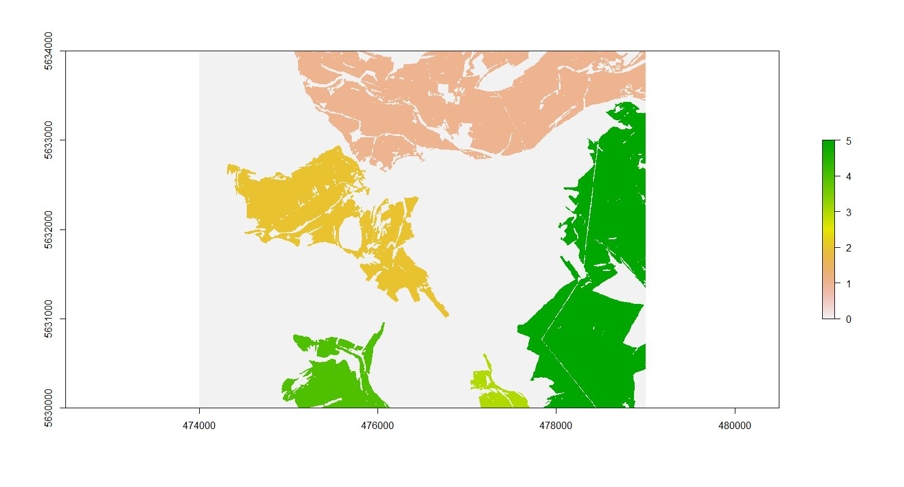
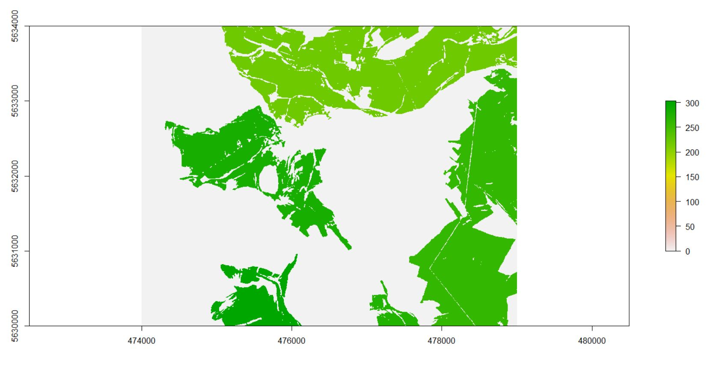
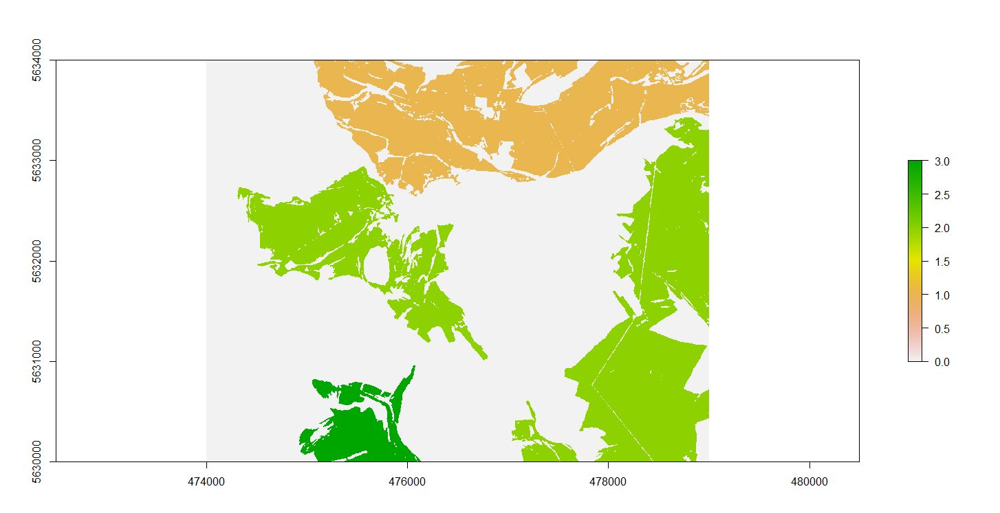

```{r setup, include=FALSE}
knitr::opts_chunk$set(echo = TRUE)
```

###Plains and Plateaus reloaded including the adjusted dominance function of the perfect peak package (C. Reudenbach 2012)


####1. start with some environmental set up

```{r eval=FALSE}
--- start setup ---
  
#if necessary install raster and rgdal
  

if (!require(RSAGA)){install.packages('RSAGA')}
if (!require(rgdal)){install.packages('rgdal')}
if (!require(raster)){install.packages('raster')}
if (!require(gdalUtils)){install.packages('gdalUtils')}
if (!require(spgrass6)){install.packages('spgrass6')}
if(!require(devtools)){install.packages("devtools")}
if(!require(XML)){install.packages("XML")})
if(!require(osmar)){install.packages("osmar")}
if(!require(gdistance)){install.packages("gdistance")}
if(!require(raster)){install.packages("raster")}


# Perfect Peak

install_github("gisma/perfectPeak")

# load libs
library(RSAGA)
library(gdalUtils)
library(raster)
library(spgrass6)
library(perfectPeak)

## (gdalUtils) check for a valid GDAL binary installation on system
gdal_setInstallation()
valid.install<-!is.null(getOption("gdalUtils_gdalPath"))
if (!valid.install){stop('no valid GDAL/OGR found')} else{print('gdalUtils status is ok')}

#-set environment variables 

source("GitHub/data/gis/data/rdata/path_gis.R")
##path to saga and OSGeo shells

source("GitHub/data/gis/data/rdata/shells.R")

# define working folder 
root.dir <- main      # root folder 
working.dir <- gis_in_base         # working folder

# set runtime arguments

epsg.code<-'EPSG:32632'           # EPSG Code for input
exact.enough<-5                   # vertical exactness of flooding in meter


# (spgrass6) define GRASS variables
grass.epsg.code<- as.numeric(substring(epsg.code,6,10))  # take substring defined projection
grass.loc<- paste0('loc',substring(epsg.code,6,10))      # define corresponding folder name
grass.mapset<- 'PERMANENT'                               # NOTE PERMANENT" is the default one and it has to be in upper cases


#  set pathes  of SAGA/GRASS modules and binaries depending on OS

  os.saga.path="C:/Gis2Go/GIS_ToGo/QGIS_portable_Chugiak_24_32bit/QGIS/apps/saga"
  saga.modules="C:/Gis2Go/GIS_ToGo/QGIS_portable_Chugiak_24_32bit/QGIS/apps/saga/modules"
  grass.gis.base= 'C:/Gis2Go/GIS_ToGo/QGIS_portable_Chugiak_24_32bit/QGIS/apps/grass/grass-6.4.3/bin'


#  delete all runtime files with filenames starting with 'run_'
file.remove(list.files(file.path(working.dir), pattern =('run'), full.names = TRUE, ignore.case = TRUE))

#  set working directory
setwd(file.path(working.dir))

# (RSAGA) define SAGA environment 
myenv=rsaga.env(check.libpath=FALSE,
                check.SAGA=FALSE,
                workspace=file.path(working.dir),
                os.default.path=os.saga.path,
                modules=saga.modules)


```

### Main Workflow with modal filter on the resulting reclassified raster


```{r eval=FALSE}
###translate elevation tif to saga format
cmd1<-paste0(OSGeo, " gdal_translate -of SAGA -ot Float32 ",
             gisrs_ba, "elevation.tif ", gisrs_trans, "elevation.sdat")

system(cmd1)


###calculate inputs forr fuzzy landform element classifier by using the saga modul "Slope, Aspect, Curvature"and the saga shell within osgeos4w


cmd2<-paste0(saga2, " ta_morphometry 0 ", 
             "-ELEVATION ",gisrs_trans, "elevation.sgrd",
             " -METHOD 6 -UNIT_SLOPE 1 -UNIT_ASPECT 1",
             " -SLOPE ", gisrs_sgpc, "slope_peak.sgrd", 
             " -ASPECT ", gisrs_sgpc, "aspect_peak.sgrd", 
             " -C_GENE ", gisrs_sgpc, "gc_peak.sgrd", 
             " -C_PROF ", gisrs_sgpc , "proC_peak.sgrd",
             " -C_TANG ", gisrs_sgpc , "tang_c.sgrd",
             " -C_MINI ", gisrs_sgpc, "min_c_peak.sgrd",
             " -C_MAXI ", gisrs_sgpc, "max_c_peak.sgrd")


system(cmd2)

###calculate fuzzy landform elements. Since we have a exceptional high resolution default threshholds have to be changed

cmd3<-paste0(saga2, " ta_morphometry 25 ", 
             "-SLOPE ", gisrs_sgpc, "slope_peak.sgrd",
             " -MINCURV ", gisrs_sgpc, "min_c_peak.sgrd",
             " -MAXCURV ", gisrs_sgpc, "max_c_peak.sgrd",
             " -PCURV ", gisrs_sgpc , "proC_peak.sgrd",
             " -TCURV ", gisrs_sgpc , "tang_c.sgrd",
             " -PLAIN ", gisrs_sgpc, "plain_peak.sgrd",
             " -FORM ", gisrs_sgpc, "form_peak.sgrd",
             " -MEM ", gisrs_sgpc, "mem_peak.sgrd",
             " -ENTROPY ", gisrs_sgpc, "entropy_peak.sgrd",
             " -CI ", gisrs_sgpc, "ci_peak.sgrd",
             " -SLOPETODEG 0 -T_SLOPE_MIN 5.000000 -T_SLOPE_MAX 15.000000",
             " -T_CURVE_MIN 0.000002 -T_CURVE_MAX 0.2")

system(cmd3)


###translate landforms this time with io_gdal

cmd4<-paste0(saga2, " io_gdal 2",
             " -GRIDS ", gisrs_sgpc, "form_peak.sgrd",
             " -FILE ",gisrs_sgpc, "landform_peak.tif" )

system(cmd4)


###reclassification of the landform output according to the code in the function 
(https://sourceforge.net/p/saga-gis/code/ci/master/tree/saga-gis/src/tools/terrain_analysis/ta_morphometry/fuzzy_landform_elements.cpp#l132)

landform<-raster(paste0(gisrs_sgpc, "landform_peak.tif"))

m<-c(0, 99, 3, 99, 101 , 1, 101, 122, 4)

land_mat<-matrix(m, ncol=3, byrow=TRUE)

plains_rc<-reclassify(landform, land_mat)


####use modal filter on plains

plains<-focal(plains_rc, w=matrix(1,15,15), fun=modal)


writeRaster(plains, paste0(gisres,  "plains.tif"), bylayer=TRUE, overwrite=TRUE)


```

### calculate some inputr for perfect peak package
```{r eval=FALSE}
###Use Perfect Peak package 
#references: C.Reudenbach: GitHub/gisma/perfectPeak 2012

# read sdat file into raster object
dem<-raster(paste0(gis_in_base,'elevation.sdat'))
#crs(dem)<-target.proj4


#clump.plains<-clump(plains) does not work on this data so we polygonize the results of the modal filter
#rasterToPolygons, as is used in the package is also  replaced by gdal_polygonize- much more efficient


##polygonize
cmd5<-paste0(OSGeo, " gdal_polygonize ", gisres, "plains.tif", " -f", paste(' "',  "ESRI Shapefile",'" ' , sep=""),gis_in_shp, "plains.shp" )

system(cmd5)

plainsshp<-shapefile(paste0(gis_in_shp, "plains"))

##diaggregate and calculate area
plains_sep<-disaggregate(plainsshp)

plains_sep$area<-area(plains_sep)


## select only polygons that are bigger than 120000 m²
max(plains_sep@data$area)

plains_pol<-plains_sep[plains_sep$area>120000,]

##select only polygons that are plains

poly_plains<-plains_pol[plains_pol@data$DN==1,]


##unique value to every plain entity

length(poly_plains) ##

poly_plains@data$unique<-1:5

shapefile(poly_plains, "Uni/1_sem/data/gis/input/raster/base/poly_plains.shp", overwrite=TRUE)

##write out Raster with area

cmd6<-paste0(OSGeo, " gdal_rasterize ",
             "-a area -ot Float32 -of GTiff -te 474000.0 5630000.0 479000.0 5634000.0",
             " -tr 1 1 -co COMPRESS=DEFLATE -co PREDICTOR=1 -co ZLEVEL=6 -l area ",
             gis_in_base, "poly_plains.shp ", gis_in_base, "area_plains.tif")

system(cmd6)
```

###Calculate dominance with adjusted dominance function

```{r eval=FALSE}
Dominance <- lapply(seq(1:5), function(i){
  
  #  (R) (1) extract single polygon from List of Polygons
  
  run_poly<-poly_plains[poly_plains@data$unique==i,]
  
  # (SAGA) (2) write shapefile 
  shapefile(run_poly, paste0(gis_in_base, "run_poly"), overwrite=TRUE)
  
  
  # (SAGA) (3) create a nodata raster for rasterizing the plain positionfor running SAGA proximity a nodata grid is necessary 
  
  rsaga.grid.calculus('elevation.sgrd', 'run_plains.sgrd','(a/a*(-99999))',env=myenv)
  
  # (RGDAL) (4) rasterize point Shape (current peak) into nodata raster file
  
  gdal_rasterize('run_poly.shp', 'run_plains.sdat', burn=1)
  
  
  #- (SAGA) dominance calculations needs 4 steps:
  # (1) calculate distance from plain to all grid cells in the raster
  # (2) create a mask raster with : all cells with an altitude <= current plain = nodata and all cells with an altitude > current plain = 1
  # (3) to derive the valid distance values multply mask raster with distance raster
  # (4) extract the minum distance valu from the resulting raster
  
  # (1) (SAGA) creates a distance raster with reference to the current plain
  system('C:/OSGeo4W64/apps/saga/saga_cmd.exe grid_tools "Proximity Grid" -FEATURES C:/Users/Jannis/Documents/GitHub/data/gis/data/raster/base/run_plains.sgrd -DISTANCE C:/Users/Jannis/Documents/GitHub/data/gis/data/raster/base/run_dist.sgrd')
  
  
  # (2) get mean altitude of current plain
  
  altitude<-extract(dem, run_poly, fun=mean)
  
  
rsaga.grid.calculus('elevation.sgrd', 'run_level.sgrd', (paste0("ifelse(gt(a,", ceiling(altitude+exact.enough/2),"),1,-99999)")), env=myenv)
  
  # (3) (SAGA) multiply level-mask by proximity raster to keep all valid distance values
  
system('C:/OSGeo4W64/apps/saga/saga_cmd.exe grid_calculus 1 -GRIDS "C:/Users/Jannis/Documents/GitHub/data/gis/data/raster/base/run_level.sgrd;C:/Users/Jannis/Documents/GitHub/data/gis/data/raster/base/run_dist.sgrd" -RESULT C:/Users/Jannis/Documents/GitHub/data/gis/data/raster/base/run.sgrd -FORMULA="a*b"')
  
  # (4.1) (R) clean file garbage from occassional opening files with QGIS
  file.remove(list.files(file.path(working.dir), pattern =('.sdat.aux.xml'), full.names = TRUE, ignore.case = TRUE))
  
  # (4.2) (GDAL) extractiong file Info
  
  file.info<-system('C:/OSGeo4W64/bin/gdalinfo.exe -mm C:/Users/Jannis/Documents/GitHub/data/gis/data/raster/base/run.sdat', intern = TRUE)
  # (4.3)( R) Minimum value is the dominance value
  
  dominance<-as.numeric(substring(file.info[29], regexpr("Min/Max=", file.info[29])+8,regexpr(",", file.info[29])-1))
  
  return (dominance)
})


###All Dominance values are 0. Our surprising conclusion: There might be no such thing as a plateau in the investigated area

```

###Prominenz algorithm adjusted to the point were polygons should be counted instead of points- we ran out of time and didn´t fix it yet


```{r eval=FALSE}
##calculate prominence with adjusted prominence function
dem<-raster(paste0(gis_in_base, "elevation.tif"))

poly_plain<-shapefile(paste0(gis_in_base, "shp_pol.shp"))


Prominence<-lapply(seq(1:5), function(i){

#--- doing some prepcocessing

# first deleting all files that are related to the prominence function
# due to the SAGA behaviour that is appending instead of overwriting the .mgrd xml files
# (R) delete temporary files
file.remove(list.files(file.path(root.dir, working.dir), pattern =('run_pro_'), full.names = TRUE, ignore.case = TRUE))

  #  create shapefiles for 'current plain' and 'all plains' and 'current_plain_poly'
#  create current_plain shape file
run_pro_current_plain<-poly_plain[poly_plain@data$unique==1,]

run_pro_current_plain@data$CLASS_ID<-255

#  create all_plains shapefile
run_pro_all_plains<-poly_plain

#  save to directory
shapefile(run_pro_current_plain, paste0(gis_in_base,"run_pro_current_plain"), overwrite=TRUE)

shapefile(run_pro_all_plains, paste0(gis_in_base,"run_pro_all_plains"), overwrite=TRUE)

##create raster of current plain=255 and rest
cmd6<-paste0(OSGeo, " gdal_rasterize ",
             " -burn 255 -a CLASS_ID -ot Float32 -of GTiff -te 474000.0 5630000.0 479000.0 5634000.0",
             " -tr 1 1 -co COMPRESS=DEFLATE -co PREDICTOR=1 -co ZLEVEL=6 -l run_pro_current_plain ",
             gis_in_base, "run_pro_current_plain.shp ", gis_in_base, "run_tst.tif")

system(cmd6)

cmd1<-paste0(OSGeo, " gdal_translate -of SAGA -ot Float32 ",
             gis_in_base, "run_tst.tif ", gis_in_base, "run_pro_current_plain_marker.sdat")

system(cmd1)

# (gdalUtils) derive infos from dem
file.info<-gdalinfo('elevation.sdat', mm=T, approx_stats=T)
# (R) obtain minimum flood altitude from 'fil_dem'
min.flood.altitude<-as.numeric(substring(file.info[29], regexpr("Min/Max=", file.info[29])+8,regexpr(",", file.info[29])-1))

# get mean altitude for each plain polygon
height<-extract(dem, run_pro_current_plain, fun=mean)

# (R) set current altitude to max flood altitude

max.flood.altitude<-floor(height)
# (R) while starting current_peak is not connected
connected<-FALSE

# (R) start flooding repeat until connecetd
while (connected == FALSE) {
  # deleting all files flooding related files to clean up
  # necessary due to the SAGA behaviour to append informtations at the .mgrd xml files
  # this slows down the process
  # (R) delete temporary files
  file.remove(list.files(file.path( working.dir), pattern =('flood_'), full.names = TRUE, ignore.case = TRUE))
  
  # for acceleration we use a binary tree search
  # the guess is always the middle of minvalue of DEM and current peak altitude
  # to we have to decide if next step we have to lift or lower the flooding altitude
  # until we are exact.enough
  
  # The loop idea we virtually flood the DEM until we got a landbrige bewteen 
  # the "current_peak" and any other highr area. 
  # implementation: 
  # set flooding level
  new.flood.altitude<-(max.flood.altitude+min.flood.altitude)/2
  
  # (R) create formula string for mask command
  formula<-paste0('ifelse(gt(a,', new.flood.altitude ,'),1,0)')
  # (RSAGA) mask level>peak set rest to nodata
  rsaga.grid.calculus('elevation.sgrd', 'flood_run_level.sgrd',formula,env=myenv)
  
  # (RSAGA) make polygon shape from current floodlevel note altitude was set
  rsaga.geoprocessor('shapes_grid', 'Vectorising Grid Classes', env=myenv,
                     list(POLYGONS='flood_run_level.shp',
                          GRID='flood_run_level.sgrd',
                          CLASS_ALL=1,
                          CLASS_ID=1.000000,
                          SPLIT=1))
  
  # (RSAGA) write "marker value 255" to the flood_run_level shapefile to mark
  # the single polygon that contains the position of current_peak
  # if we dont "split the flood_run_level.shp we can not use a specified query
  
  
  
  rsaga.geoprocessor("shapes_grid","Grid Statistics for Polygons", env=myenv,
                     list(GRIDS="run_pro_current_plain_marker.sgrd" ,
                          POLYGONS="flood_run_level.shp",
                          MAX=T,
                          QUANTILE=0,
                          RESULT="flood_run_result.shp"))
  
  
  
  # (gdalUtils) select the current_peak polygon
  ogr2ogr('flood_run_result.shp', 'flood_run_select.shp',
          f="ESRI Shapefile",
          select='RUN_PRO_CU', where="RUN_PRO_CU = 255",
          overwrite=TRUE)
  
  flood_run_result<-shapefile("flood_run_result.shp")
  
  # (RSAGA) count how much polygons are inside the selceted polygon item
  
  
  ##############thats where we failed
  
  rsaga.geoprocessor('shapes_polygons',0, env=myenv,
                     list(Polygons="run_pro_all_plains.shp",
                          Polygons="flood_run_result.shp"))
  
  # (RSAGA) convert this to a ASCII csv file
  rsaga.geoprocessor('io_shapes', 2 ,env=myenv,
                     list(POINTS='flood_run_result.shp',
                          FIELD=TRUE,
                          HEADER=TRUE,
                          SEPARATE=0,
                          FILENAME='flood_run_result.txt'))
  
  # (R) read it into data frame
  result=read.csv(file = 'flood_run_result.txt', header=T, sep="/t",dec='.')
  
  # (R) check if the table has correct dimensions
  #if (ncol(result)!=7) {stop('no results during selection of the peak polygon -> have to stop')}
  
  # (R) name the cols
  colnames(result)=c("c1","c2","c3","c4","c5","c6","c7","c8","c9","c10","c11","c12","c13","c14" )
  
  # (R) filter if c6=255 and c7 > 1 (= peak_polygon contains more than one peak => landbridge is closed)
  if (nrow(subset(result,result$c8 == 255 & result$c9 > 1)) > 0){
    # landbrige is closed but maybe in avery coarse way so check if the difference is small enough default=5
    if((max.flood.altitude-min.flood.altitude) < exact.enough){
      # closed landbrige is found
      connected<- TRUE
    }else{
      # if are connected but we flooded to deep (i.e. > exact enough) we rise flooding level half the way up
      min.flood.altitude<- new.flood.altitude}
  }else{
    # if we are not conneced we will lower the flooding level half the way down
    max.flood.altitude<- new.flood.altitude
  }
}
## we just created the mask to derive the notch value lets get this value
# (RSAGA) create raster with value=0
rsaga.grid.calculus(c('mp_dem.sgrd;flood_run_level.sgrd'), 'run_level_raw.sgrd', ~(a*b), env=myenv)

# (RSAGA) forces nodata reclass to derive true minimum
rsaga.grid.calculus('run_level_raw.sgrd', 'run_level.sgrd','ifelse(eq(a,0),-99999,a)',env=myenv)

# (R) dirty but have to to this if you open run_level.sgrd in qgis this file
# is created and shifts the index value of gdalinfo
file.remove(list.files(file.path(root.dir, working.dir), pattern =('.aux.xml'), full.names = TRUE, ignore.case = TRUE))

#- min calculation
# (gdalUtils) extract info -mm calculates the min max info -approx_stats force
file.info<-gdalinfo('run_level.sdat', mm=T)

# (R) get the prominence (min)value
notch<-as.numeric(substring(file.info[29], regexpr("Min/Max=", file.info[29])+8,regexpr(",", file.info[29])-1))

# (R) calculate the prominence
prominence<- ceiling(altitude)-notch
return (prominence)
})


###so no values for prominence
```

###since we do not have useful results from the dominance function and no results from the prominence we turn back to our former approach and tell higher plains from lower plains reclassifying in three categories- there is no plateau

```{r eval=FALSE}
##get variables for classification

###calculate mean altitude
mean_altitude<-extract(dem, poly_plains, fun=mean)

poly_plains@data$altitude<-as.vector(mean_altitude)

shapefile(poly_plains, "plains_alt.shp")

cmd6<-paste0(OSGeo, " gdal_rasterize ",
             " -a altitude -ot Float32 -of GTiff -te 474000.0 5630000.0 479000.0 5634000.0",
             " -tr 1 1 -co COMPRESS=DEFLATE -co PREDICTOR=1 -co ZLEVEL=6 -l plains_alt ",
             gis_in_base, "plains_alt.shp ", gis_in_base, "plain_alt.tif")

system(cmd6)

altitude<-raster("plain_alt.tif")


##### reclassify plains by three different altitudes


m<-c(0, 230, 1, 230, 290 , 2, 290, 400, 3)

mat<-matrix(m, ncol=3, byrow=TRUE)

plains_rc<-reclassify(altitude, mat)

writeRaster(fuzz_rc_peak_final, paste0(gisres, "plains_plateaus_peak.tif"), bylayer=TRUE, overwrite=TRUE)


```


##Results

###after selecting only entities with an area bigger than 120000 m² we reduced the total number of entities to 5



###as can be seen in the picture below, differences in altitude are pretty small




### we decided for three classes 0-230=brownish, 230-290= light green, >290=dark green


