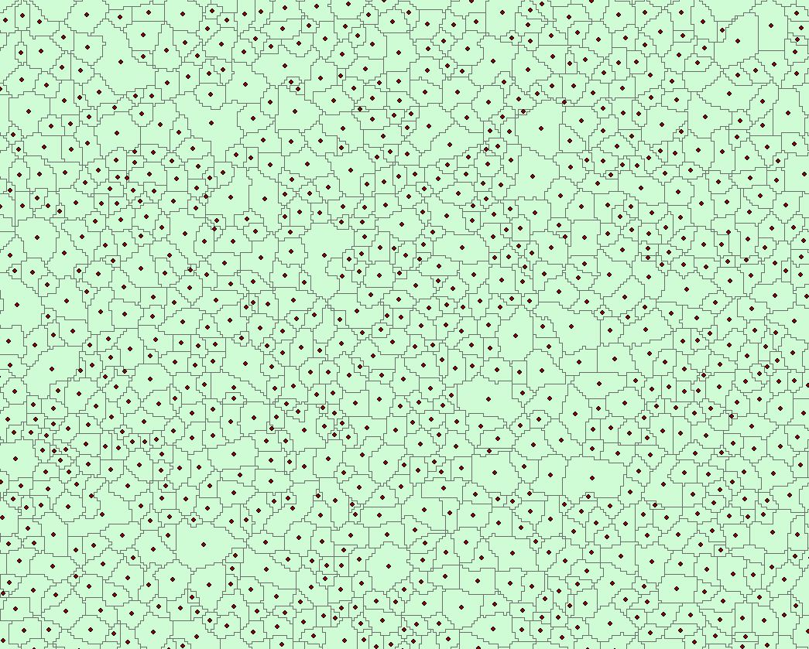
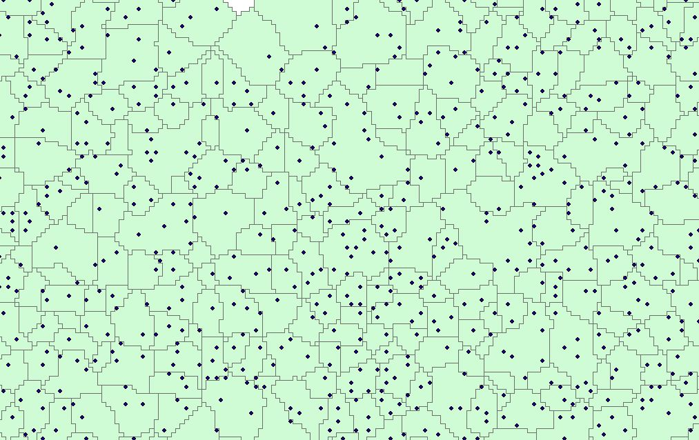
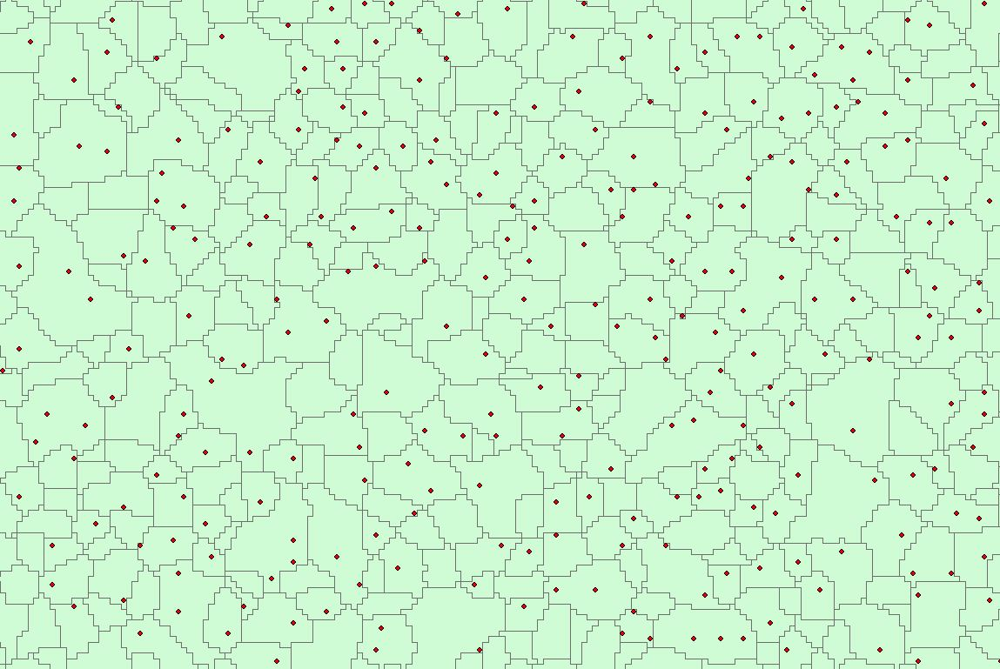

```{r setup, include=FALSE}
knitr::opts_chunk$set(echo = TRUE)
```

## R Markdown

We tried three different approaches to identify trees in the Muff. The most common is the watershed segmentation (http://dominoc925.blogspot.de/2012/03/counting-trees-using-segmentation-and.html-but with minimum heights). Second we tried an approach that involves the software "Fusion" and sepperates trees by maximum heights. Third we developed our own algorithm that finds local minima in a focal window and creats points that can be used as gauges. From these gauges the catchment area can be calculated by using the grass gis add on r.catchment. In r.catchment a maximum area for the catchment (treecrown) can be specified.


###watershed segmentation
```{r eval=F}

source("GitHub/data/gis/data/rdata/path_gis.R")
source("GitHub/data/gis/data/rdata/shells.R")
library(raster)
library(rgdal)
library(gdalUtils)

runDir<-paste0(gisras, "trees/")


# canopy height model


dsm<-raster(paste0(gisras,"canopy/geonode-lidar_dsm_01m.tif"))
dem<-raster(paste0(gisras,"canopy/geonode-lidar_dem_01m.tif"))

chm <- dsm - dem

plot(chm, main="LiDAR Canopy Height Model")

# inverted surface model
invChmR<-chm + minValue(chm)*-1

###exclude below 5m
invChmR[invChmR<5]<-NA

invChmR_neg<-invChmR*-1

# smooth canopy
inv_chm_focal <- focal(invChmR_neg, w = matrix(1, 5, 5), fun=max)

writeRaster(inv_chm_focal, filename = paste0(runDir, "inv_chm_focal.tif"), overwrite = TRUE)


# translate
cmd1<-paste0(OSGeo, " gdal_translate -of SAGA -ot Float32 ",
             runDir, "inv_chm_focal.tif ", runDir, "inv_chm_focal.sdat")

system(cmd1)

# SAGA Watershed Segmentation
cmd2<-paste0(saga2, " imagery_segmentation", paste(' "',  "Watershed Segmentation",'" ' , sep=""), "-GRID ", runDir, "inv_chm_focal.sgrd -OUTPUT 1 -DOWN 0 -JOIN 0 -THRESHOLD 0 -BBORDERS -SEGMENTS ",
runDir, "SEGMENTS.sdat -SEEDS ", runDir, "SEEDS.shp ", "-BORDERS ",runDir,"BORDERS.sdat")

system(cmd2)

# 
cmd3<-paste0(OSGeo, " gdal_translate -ot Float32 ",
             runDir, "SEGMENTS.sdat ", runDir, "SEGMENTS.tif")

system(cmd3)

segments<-raster(paste0(runDir, "SEGMENTS.tif"))


##polygonize
cmd5<-paste0(OSGeo, " gdal_polygonize ", runDir, "SEGMENTS.tif", " -f", paste(' "',  "ESRI Shapefile",'" ' , sep=""),runDir, "trees.shp" )

system(cmd5)
# load polygons
trees <- shapefile(paste0(runDir,"trees.shp"))


##get cntroids

centroids <- getSpPPolygonsLabptSlots(trees)


centroids<-data.frame(centroids)
xy <- centroids[,c(1,2)]

tree_points <- SpatialPointsDataFrame(coords = xy, data = centroids)


writeOGR(tree_points, dsn = paste0(runDir, "tree_centroids.shp"), driver = "ESRI Shapefile", layer = "tree_centroids")

nrow(centroids)
````

This approach counted 119690 trees in the Muff- but houses have been identified as trees too. 



###fusion
```{r eval=FALSE}
source("C:/Users/Jannis/Documents/GitHub/data/gis/data/rdata/path_gis.R")

#install.packages("raster", dependencies = TRUE)
library(rLiDAR)
library(raster)
mainDir <- paste0(gisdat, "lidar")
inDir <- "inputDirectory"
outDir<- gisres
dir.create(file.path(mainDir, outDir), showWarnings = FALSE)

FindTreesCHM <- function(chm, fws = 5, minht = 1.37) 
{
  if (class(chm)[1] != "RasterLayer") {
    chm <- raster(chm)
  }
  if (class(fws) != "numeric") {
    stop("The fws parameter is invalid. It is not a numeric input")
  }
  if (class(minht) != "numeric") {
    stop("The minht parameter is invalid. It is not a numeric input")
  }
  w <- matrix(c(rep(1, fws * fws)), nrow = fws, ncol = fws)
  chm[chm < minht] <- NA
  f <- function(chm) max(chm)
  rlocalmax <- focal(chm, fun = f, w = w, pad = TRUE, padValue = NA)
  setNull <- chm == rlocalmax
  XYmax <- SpatialPoints(xyFromCell(setNull, Which(setNull == 
                                                     1, cells = TRUE)), proj4string = crs(chm))
  htExtract <- over(XYmax, as(chm, "SpatialGridDataFrame"))
  treeList <- cbind(coordinates(XYmax), htExtract)
  colnames(treeList) <- c("x", "y", "height")
  return(treeList)
}

list<-list.files(mainDir, recursive=TRUE, pattern=glob2rx("*.las" ))

# Read in the las file and produce a ground file

canopies<-lapply(seq(list), function(i){
  system(paste(file.path("C:","Fusion", "groundfilter.exe"),
               "/gparam:0 /wparam:1 /tolerance:1 /iterations:10",
               file.path(outDir, paste0(list[[i]], "_GroundPts.las")),
               1,
               file.path(mainDir, list[[i]]),
               sep=" "))
  
  system(paste(file.path("C:","Fusion", "gridsurfacecreate.exe"),
               file.path(outDir, paste0(list[[i]],"caldern.dtm")),
               "1 M M 1 12 2 2",
               file.path(outDir, paste0(list[[i]],"_GroundPts.las")),
               sep=" "))
  
  system(paste(file.path("C:","Fusion", "canopymodel.exe"),
               paste("/ground:",file.path(outDir,paste0(list[[i]], "caldern.dtm")), sep=""),
               file.path( outDir, paste0(list[[i]],"caldern.dtm")),
               "1 M M 1 12 2 2",
               file.path(mainDir, list[[i]]),
               sep=" "))
  
  system(paste(file.path("C:","Fusion", "dtm2ascii.exe"),
               file.path(outDir,paste0(list[[i]], "caldern.dtm")),
               file.path(outDir,paste0(list[[i]], "caldern.asc")),
               sep=" "))
  
  
  
  
  # Import the LiDAR-derived CHM file
  chm<-raster(file.path(outDir, paste0(list[[i]],"caldern.asc")))
  plot(chm)
  
  # Smoothing the CHM using a Gaussian filter
  # Set the ws:
  ws<-3 # dimension 3x3
  # Set the filter type
  filter<-"Gaussian"
  # filter<-"mean"
  # Set the sigma value
  sigma<-0.5
  sCHM<-CHMsmoothing(chm, filter, ws, sigma) 
  
  # Setting the fws:
  fws<-3 # dimention 3x3
  # Setting the specified height above ground for detectionbreak
  minht<-2.0
  # Getting the individual tree detection list
  
  loc<-FindTreesCHM(sCHM, fws, minht)
  summary(loc)
  
  # Set the maxcrown parameter - maximum individual tree crown radius expected
  maxcrown=10.0
  # Set the exclusion parameter
  exclusion=0.1 # A single value from 0 to 1 that represents the % of pixel
  # exclusion. E.g. a value of 0.5 will exclude all of the pixels 
  # for a single tree that has a height value of less than 50% of the 
  # maximum height from the same tree. Default value is 0.3.
  # Compute individual tree detection canopy area
  canopy<-ForestCAS(sCHM, loc, maxcrown, exclusion)
  
  # Retrieving the boundary for individual tree detection and canopy area calculation
  boundaryTrees<-canopy[[1]]
  
  # Retrieving the list of individual trees detected for canopy area calculation
  canopyList<-canopy[[2]] # list of ground-projected areas of individual tree canopies
  summary(canopyList)     # summary
  canopyList$crad<-sqrt(canopyList$ca/pi)
  write.csv(canopyList, file.path( outDir,paste0(list[[i]],"canopy_Out.csv")))
  
  return(canopyList)})

setwd((paste0(gisres, "trees"))
trees_fusion<-list.files(recursive=TRUE, pattern="*.csv")


myfiles = do.call(rbind, lapply(trees_fusion, function(x) read.csv(x, stringsAsFactors = FALSE)))

xy <- myfiles[,c(2,3)]

tree_points_fusion <- SpatialPointsDataFrame(coords = xy, data = myfiles)


writeOGR(tree_points_fusion, dsn = paste0(runDir, "tree_points_fusion.shp"), driver = "ESRI Shapefile", layer = "tree_points_fusion")

nrow(myfiles)


```

The Fusion approach seems to overestimate the total number of trees (308796). On each polygon of the watershed segmentation approach come at least 3 points from the fusion approach. 


###local minima algorithm (our own algorithm)
```{r eval=FALSE}
library(raster)
library(rgdal)

source("GitHub/data/gis/data/rdata/path_gis.R")

dsm<-raster(paste0(gisras,"canopy/geonode-lidar_dsm_01m.tif"))
dem<-raster(paste0(gisras,"canopy/geonode-lidar_dem_01m.tif"))

chm <- dsm - dem

plot(chm, main="LiDAR Canopy Height Model")

# inverted surface model and threshold for trees
invChmR<-chm + minValue(chm)*-1
invChmR[invChmR<5]<-NA
invChmR_neg<-invChmR*-1


writeRaster(invChmR_neg,paste0(gisras,"invChmR_neg.tif"), overwrite=TRUE)

## the size of the focal window works as a filter
f <- function(X) min(X, na.rm=TRUE)
localmin <- focal(invChmR_neg,w=matrix(1,7,7), fun = f, pad=TRUE, padValue=NA)

writeRaster(localmin,paste0(gisras,"localmin.tif"), overwrite=TRUE)

## Does each cell have the minimum value in its neighborhood?
r2 <- invChmR_neg==localmin

## Get x-y coordinates of those cells that are local minima
minXY <- xyFromCell(r2, Which(r2==1, cells=TRUE))

minXY<-data.frame(minXY)
xy <- minXY[,c(1,2)]

spdf <- SpatialPointsDataFrame(coords = xy, data = minXY)

projection<-"+proj=utm +no_defs +zone=32 +a=6378137 +rf=298.257222101 +towgs84=0,0,0,0,0,0,0
+to_meter=1" 
projection(spdf)<-"+proj=utm +zone=32 +ellps=GRS80 +towgs84=0,0,0,0,0,0,0 +units=m +no_defs"

shapefile(spdf, paste0(gisshp, "minXY.shp"), overwrite=TRUE)


### we could not get the r.catchment modul to work. It would be the perfect tool since one can specify the are of the catchment (treecrown) for every gauge (single points at local minima). This approach would be new-we could not find any documentation on the internet where someone used this workflow. Perhaps we can figure it out.

install.packages("rgrass7")

initGrass4R(invChmR_neg,c("C:/Users/Jannis/Documents/GRASS_GIS_7.2.0/grass72.bat", "GRASS GIS 7.2.0", "NSIS"), spdf)

R_CATCHMENT<-localmin


tst<-execGRASS("r.catchment", elevation="invChmR_neg.tif",  start_points="minXY", 
               buffer="R_CATCHMENT", area=5, map_val=1)


````
 our own algorithm seems to work pretty good according to the number of points (133025). Visual analysis shows, that in some cases the watershed segmentation approach seems to overestimate the size of trees, while our own algorithm identifies min two trees in the same polygon. If we were able to get the r.catchment modul to run, this would be our preferred approach.


