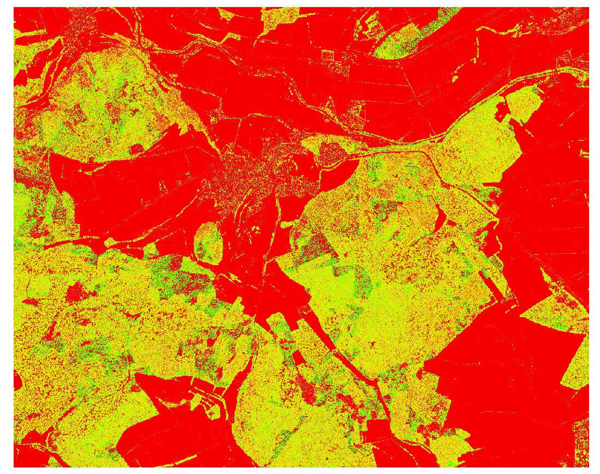

```{r setup, include=FALSE}
knitr::opts_chunk$set(echo = TRUE)
```

## R Markdown
##Calculating the density

```{r eval=FALSE}
library(raster)
library(rgdal)
source("GitHub/data/gis/data/rdata/path_gis.R")

# load ground returns and above ground returns

pcag <- raster(paste0(gisras, "biomass/geonode-lidar_pcag_01m.tif"))
pcgr <- raster(paste0(gisras, "biomass/geonode-lidar_pcgr_01m.tif"))


###get total points

pc_total<-pcag+pcgr

### the ratio of the above ground points to the total points is from 0 to 1 where 
#0.0 represents no canopy and 1.0 very dense canopy

canopy_density<-pcag/pc_total


```

