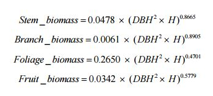

```{r setup, include=FALSE}
knitr::opts_chunk$set(echo = TRUE)
```

## Wood, biomass & more
To estimate the different types of biomass in a forest stand, He et al. 2013 developed formulas that use diameter at breast height (DBH) and height of the tree (H).


We do have a datasets with the local minima in a 3x3 focal window that gives us the required information of the height of trees, but we do not have any information on the DBH. According to Hemery et al. 2005 (http://www.sciencedirect.com/science/article/pii/S0378112705003373), there is a weak linear relationship between height and DBH (r²=0.6) while the linear relation between crown diameter and BHD is high (r²=0.9 for fagus sylvatica).


###calculate the crown diameter
We do have a rough estimation of the crown area due to the watershed segmentation of the lidar derived inverse canopy height models. Since some of the polygons intersect with more than one point from the local minima dataset, we decided to devide the area of the polygon by the number of intersecting points. We then calculated the crown diamter (sqrt(area/pi)*2) assuming the shape of a circle for each crown.

```{r eval=FALSE}

###set up
library(raster)
library(rgdal)
source("GitHub/data/gis/data/rdata/path_gis.R")

min<-shapefile(paste0(gisshp, "minXY_neu.shp"))####local minima

poly<-shapefile(paste0(gisras, "trees/trees.shp")####result of watershed segmentation

                ###canopy height model            
dsm<-raster(paste0(gisras,"canopy/geonode-lidar_dsm_01m.tif"))
dem<-raster(paste0(gisras,"canopy/geonode-lidar_dem_01m.tif"))
                
chm <- dsm - dem

###extract heights to point shape
min@data$height<-extract( chm, min)

###create field with point count
points_in_poly<-over(min, poly)

###take mean heights of local minima
points_in_poly@data$mean_height<-points_in_poly@data$Sum_height/points_in_poly@data$Sum_Count

###delete polygons with no local minima
points_in_poly<-subset(points_in_poly, !points_in_poly@data$Sum_Count==0)

###calculate are of polygons and devide it through the points                
points_in_poly@data$area<-area(points_in_poly)
points_in_poly@data$crown_area<-points_in_poly@data$area/points_in_poly@data$Sum_Count

### calculate crown diameter                
points_in_poly@data$crown_diameter<-(sqrt(points_in_poly@data$crown_area/pi))*2
                


```

##calculate DBH
Since we know the linear realtionship of crown diameter an DBH for fagus sylvatica and most of the stands in the Muff are beech, we only had to flip-flop the formula of the linear relation to: DBH=(15.2331(slope)+1.1331(intercept))/crown_diameter
```{r eval=FALSE}
points_in_poly@data$stem_diameter<-(15.233 +1.1331)/points_in_poly@data$crown_diameter
```

##calculate Biomass
Now we have every parameter we need to calculate the different types of biomass according to the formulas of He et al. 2013. Since we devided the crown area by the number of points, we have to multiply the biomass by it.


```{r eval=FALSE}
         
points_in_poly@data$stem_biomass<-(0.0478*(points_in_poly@data$stem_diameter^2*points_in_poly@data$mean_height)^0.8665)
*points_in_poly@data$Sum_Count
                
points_in_poly@data$branch_biomass<-(0.0061*(points_in_poly@data$stem_diameter^2*points_in_poly@data$mean_height)^0.8905)
*points_in_poly@data$Sum_Count
                
points_in_poly@data$foliage_biomass<-(0.2650*(points_in_poly@data$stem_diameter^2*points_in_poly@data$mean_height)^0.4701)
*points_in_poly@data$Sum_Count
                
points_in_poly@data$fruit_biomass<-(0.0342*(points_in_poly@data$stem_diameter^2*points_in_poly@data$mean_height)^0.5779)
*points_in_poly@data$Sum_Count

````


###results
```{r eval=FALSE}
stem_biomass<-sum(points_in_poly@data$stem_biomass)
branch_biomass<-sum(points_in_poly@data$branch_biomass)
foliage_biomass<-sum(points_in_poly@data$foliage_biomass)
fruit_biomass<-sum(points_in_poly@data$fruit_biomass)
````

stem_biomass=147105.8; 
branch_biomass=20989.43;
foliage_biomass=133047.7;
fruit_biomass=27952.55;

###dicussion

 Foliage biomass showed a very low accuracy (r²=0.3) in the study of He and colleagues while stem- and branch biomass showed high accuracies (r²=0.8). Since we do not have a classification of the Muff, even for stem- and branch biomass these numbers are nothing but a very rough estimation.

