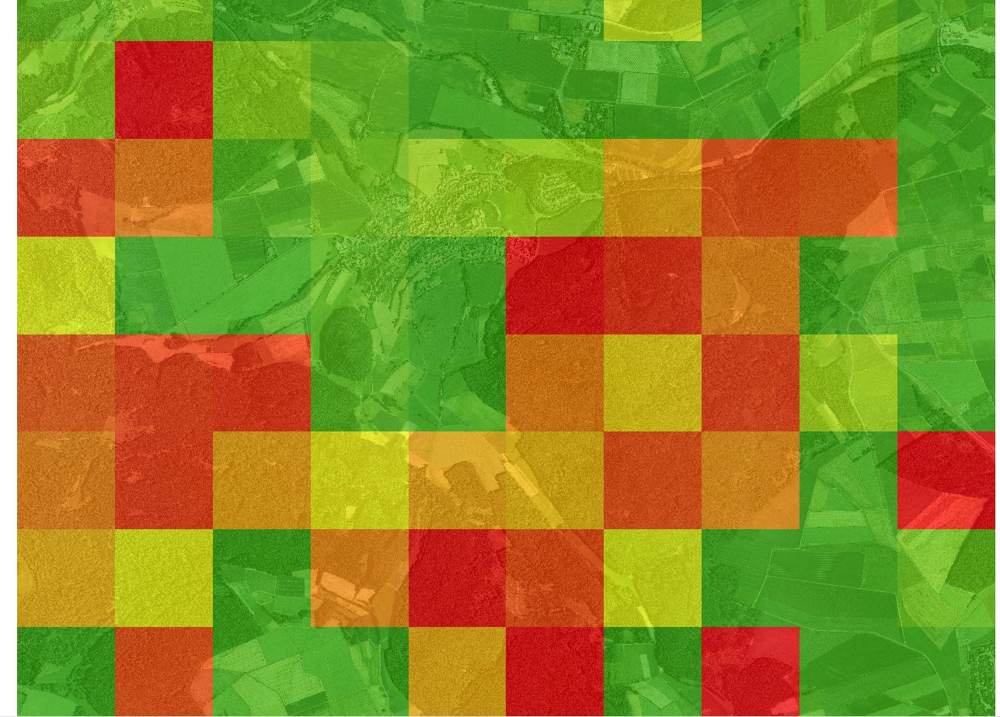

```{r setup, include=FALSE}
knitr::opts_chunk$set(echo = TRUE)
```

## Heatmap of the Muf

For identifying single trees and for estimating the biomass see gi-ws-08-2

```{r eval=FALSE}
library(raster)
library(rgdal)
library(rgrass7)
source("GitHub/data/gis/data/rdata/path_gis.R")


##get trees from gi-ws-08-2
min<-readOGR(paste0(gisshp, "minima.shp"), layer="minima")

##get functions creuden

sapply(list.files(pattern="[.]R$", path="C:/Users/Jannis/Documents/GitHub/data/gis/code/msc-phygeo-class-of-2016-creuden-master/msc-phygeo-class-of-2016-creuden-master/fun/", full.names=TRUE), source)

linkGRASS7(raster::raster(min))

input=paste0(gisshp,"minima.shp")
radius=50

  # (GRASS) import
  rgrass7::execGRASS('v.in.ogr',  
                     flags=c('o',"overwrite","quiet"),
                     input=paste0(gisshp,"minima.shp"),
                     output="rt_treeNodes"
  )
  
  
  # (GRASS) kernel density
  rgrass7::execGRASS('v.kernel',  
                     flags=c("quiet"),
                     input="rt_treeNodes",
                     output="rt_heatmap_trees",
                     radius=radius)
  
  # (GRASS) export to GeoTiff
  rgrass7::execGRASS('r.out.gdal',  
                     flags = c("overwrite","quiet","c"),
                     input = "rt_heatmap_trees",
                     output = paste0(gisshp,"rt_heatmap_trees_",as.character(radius),".tif"),
                     type="Float64")
  
 
    heatTrees <- raster::raster(paste0(gisshp,"rt_heatmap_trees_",as.character(radius),".tif"))

plot(heatTrees)


```



##results
Conifer stands are "hotter" than broadleaf stands. 