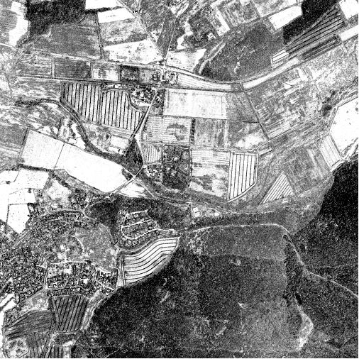
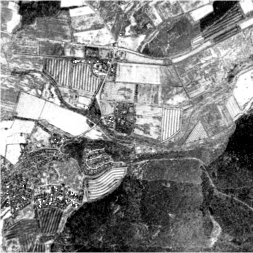

```{r setup, include=FALSE}
knitr::opts_chunk$set(echo = TRUE)


```

## Spatial filtering

####Computing filters for set of window extents

```{r eval=FALSE}

install.packages("glcm")
library(glcm)
library(raster)

source("GitHub/msc_phygeo_class_of_2016/remote_sensing_2016/data/rdata/path_rs.R")
source("GitHub/msc-phygeo-class-of-2016-JAGOW/remote_sensing/rs-ws-04-1/green_leave_idx.R")

#list all tiles

tst_lst<-list.files(rsras_airP, recursive=TRUE, pattern=glob2rx("*.tif"), full.names=TRUE)


##green leve index on all tiles
s_gl<-lapply(seq(tst_lst), function(i){
  x<-stack(tst_lst[i])
  z<-green_leave_idx(x)
  return(z)
})

##homogeneity on one tile

hom_one<-lapply(seq(3:50), function(i)
{
  if(i%%2!=0)
  {
    x<-glcm(s_gl[[4]], window=c(i,i), statistics="homogeneity")
    return(x)
  }
})


saveRDS(hom_one, file = paste0(rsres,"hom_one.rds"))

#example tiles

hom3x3 <- hom_one[[1]]
hom21x21 <- hom_one[[21]
hom51x51 <- hom_one[[51]]

writeRaster(hom3x3, filename = paste0(rsres,"hom3.tif"), overwrite=F)
writeRaster(hom21x21, filename = paste0(rsres,"hom21.tif"), overwrite=F)
writeRaster(hom51x51, filename = paste0(rsres,"hom51.tif"), overwrite=F)

#calculate homogeneity with best resolution (window of 21x21) for all tiles

hom_all<-lapply(seq(s_gl), function (i) {
  x<-glcm(s_gl[[i]], window=c(21,21), statistics="homogeneity")
  return(x)
  })
saveRDS(hom_all, file = paste0(rsres,"hom21.rds"))
```

####Visualization of data, how does filter work?

```{r eval=FALSE }
small <- raster(paste0(rsres,"hom3.tif"))
well_suited <- raster(paste0(rsres,"hom21.tif"))
big <- raster(paste0(rsres,"k4hom.tif"))
```

The aim of the filter is to describe the relations of gray-levels in the 
environment of a certain pixel. The frequency of neighbouring pixels after 
certain definition of neighborhood is being used to calculate the overall
homogeneity of the image. 

```{r eval=FALSE }
hist(small)
hist(well_suited)
hist(big)
boxplot(small)
boxplot(well_suited)
boxplot(big)
```








The filter resolution we chose is better suitable for a landuse-classification, 
because as can be seen in the pictures, neither the smallest nor the 
biggest resolution is able to differentiate nicely the different types of 
landcover by their gray-levels. This is due to the high resolution of pixels. 
