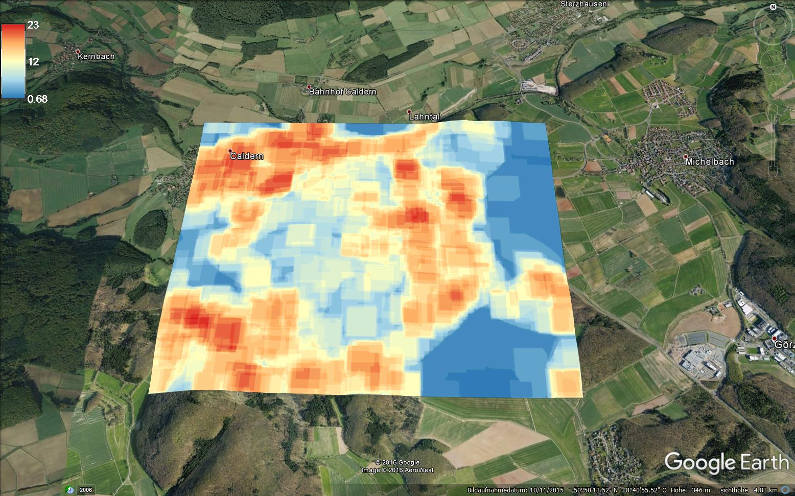
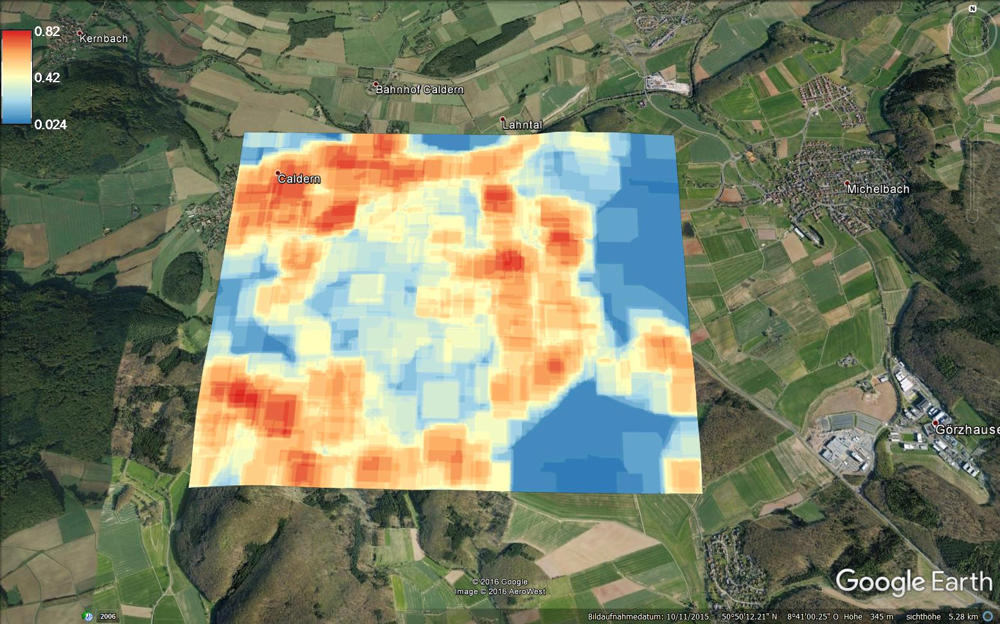
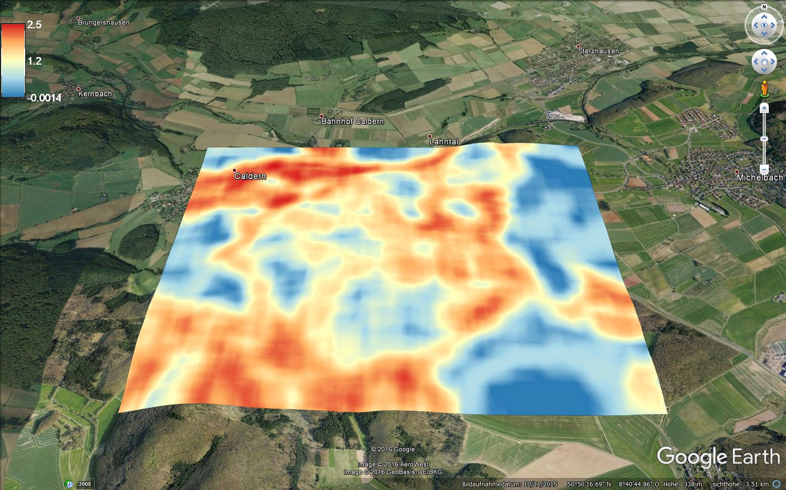
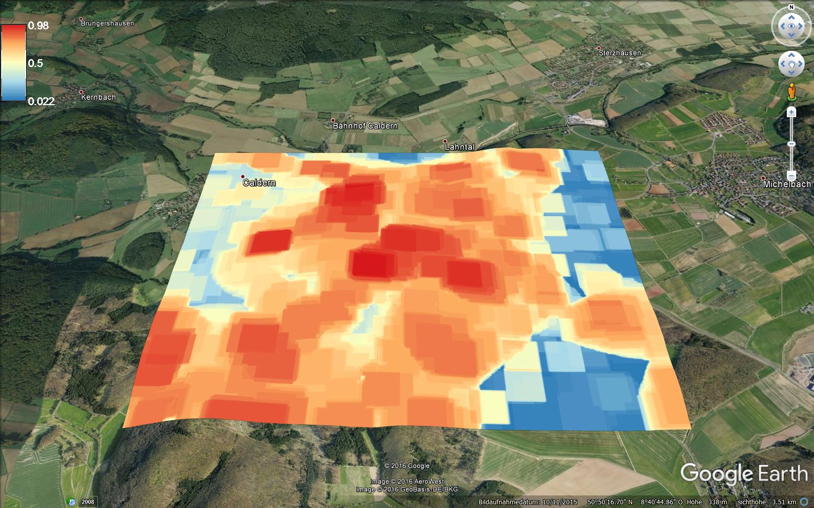

```{r setup, include=FALSE}
knitr::opts_chunk$set(echo = TRUE)
```

#### Get some stuff together
It is time to combine results from remote sensing and advanced GIS. In this worksheed we are going to calculate  the biomass of the Muf based on linear relations of DBH, height and canopy diameter for the different species and some diversity metrics on species and on landscape level. Additionally we developed some formulas to assess the diversity of different maturity states as a measure of natural succession based on the diversity of tree heights in 1ha.


## Biomass

Since we now have a trustable tree species classification we can alter the algorithm for the biomass estimation to linear relations for each species after Bonnor 1968 (https://www.jstor.org/stable/42603649?seq=4#page_scan_tab_contents)
and Hemery et al. 2005 (http://www.sciencedirect.com/science/article/pii/S0378112705003373). We stick to the concept of circled crowns, since the crown diameter is a derivation of the area of the crown and then again the area of the crown is critical for the productivity of a tree.


```{r eval=FALSE}
##get positions of local minima
min<-shapefile(paste0(gisshp, "minXY_neu.shp"))
dsm<-raster(paste0(gisras,"canopy/geonode-lidar_dsm_01m.tif"))
dem<-raster(paste0(gisras,"canopy/geonode-lidar_dem_01m.tif"))
chm <- dsm - dem
##extract height
min@data$height<-extract( chm, min)

##exctract landcover ID
landcover<-raster("GitHub/data/gis/results/fragstats/landcover_modal.tif")

##crop to extent of the MUF
min_crop<-crop(min, landcover)

min_crop@data$ID<-extract(landcover, min_crop)

writeOGR(min_crop, dsn=paste0(gisshp, "min_height_class.shp"), layer="min_height", driver="ESRI Shapefile")

##spatial join in arcgis-get polygon

poly<-readOGR("GitHub/data/gis/results/fragstats/points_per_poly.shp", layer="points_per_poly")


##create some measures needed for the estimation of the DBH
#total area
poly@data$area<-raster::area(poly)
#crown area devided through local maxima
poly@data$crown_area<-poly@data$area/poly@data$Sum_Count
#crown diameter
poly@data$crown_diameter<-(sqrt(poly@data$crown_area/pi))*2

#reclassify some data
x<-poly
x[x@data$Max_class==41]<-20##one value for spruce
x[x@data$Max_class==2]<-3##one value for oak
x[x@data$Max_class==11 | x@data$Max_class==12]<-10##one value for beech 
x[x@data$Max_class==51 | x@data$Max_class==52]<-50 ##one value for douglas

spruce=20
oak=3
beech=10 
douglas=50 

  x@data$stem_diameter<-0
  
  for(i in 1:nrow(x@data)){
    if(x@data$Max_class[i]==oak)# after Hemery et al. 2005
      
    {x@data$stem_diameter[i]<-(15.6159 +1.71733)/x@data$crown_diameter[i]}
    
      else if (x@data$Max_class[i]==beech)# Hemery et al. 2005
      {
        x@data$stem_diameter[i]<-(15.233 +1.1331)/x@data$crown_diameter[i]}
  
      else if  (x@data$ID[i]==spruce)# after Boonor 1968- here crown diameter and height are combined
      {
        x@data$stem_diameter[i]<-(1.706+ 0.1264*
          x@data$Max_height[i])+(0.2009*x@data$crown_diameter[i])+
          (0.002284*(x@data$Max_height[i]*x@data$crown_diameter[i]))
      }
  else if  (x@data$ID[i]==douglas)# after Boonor 1968- here crown diameter and height are combined
  {
    x@data$stem_diameter[i]<-0.247+ (0.08023*
                                x@data$Max_height[i])+(0.05529*x@data$crown_diameter[i])+
      (0.004292*(x@data$Max_height*x@data$crown_diameter[i]))
  }})
 

##calculate Biomass


x@data$stem_biomass<-0.0478*(x@data$stem_diameter^2*x@data$mean_height)^0.8665

x@data$branch_biomass<-0.0061*(x@data$stem_diameter^2*x@data$mean_height)^0.8905

x@data$foliage_biomass<-0.2650*(x@data$stem_diameter^2*x@data$mean_height)^0.4701

x@data$fruit_biomass<-0.0342*(x@data$stem_diameter^2*x@data$mean_height)^0.5779

##total Biomass

stem_biomass<-sum(x$stem_biomass)

branch_biomass<-sum(x@data$branch_biomass)

foliage_biomass<-sum(x@data$foliage_biomass)

fruit_biomass<-sum(x@data$fruit_biomass)

```

###results
stem_biomass:
506086.2 t
branch_biomass:
78277.98 t
foliage_biomass:
139665.1 t
fruit_biomass:
38954.94 t


###Stand Density Index
The Stand Density Index is a mean for the density of trees in a stand. The Formula for a 1ha is:
SDI=Number of trees/ha*(DBH/25)^1.605
````{eval=False}
trees_per_cell<-rasterize(min, fiel="count", fun="count", mask=landcover)

trees_per_ha<-focal(trees_per_cell, w=matrix(1,101,101))

x@data$trees_per_ha<-extract(trees_per_ha, x, fun="max")

#SDI for the position of individual trees
x@data$SDI<-x@data$trees_per_ha/(x@data$stem_diameter/25)^1.605

````

#Diversity of the Muf on individual Trees

##Shannon Diversity Index
Shannon’s diversity index is a popular measure of diversity in community ecology. Shannon’s index is sensitive to rare classes. SHDI equals minus the sum, across all patch types, of the proportional abundance of each patch type multiplied by that proportion.

```{r eval=FALSE}
##get stems
stem<-readOGR("GitHub/data/gis/results/fragstats/points_in_the_muf.shp", layer="points_in_the_muf")

##get classification
landcover<-raster("GitHub/data/gis/results/fragstats/landcover_modal.tif")

##extract tree species
stem@data$species<-extract(landcover, stem)

##get raster layer for extraction of individual classes in buffer
species<-mask( landcover,stem)

##create shannon function
shannon <- function(x, ...) {
  cnts <- table(x)
  cnts <- cnts / sum(cnts)
  -sum(cnts * log(cnts))
}

##calculate shannon diversity for different buffers
for (j in 1:nrow(stem)){
  if (!is.na(stem@data$species[j])){
    for (i in seq(1,100,by=10)){
      tst<-buffer(stem[j,], width=i)
      buftst<-extract(species, tst)
      new_colname<-paste("shannon", i, sep="")
      stem@data[new_colname]<- shannon(buftst)
    }}}
 

````
calculating since 05.02.2016 19:00. Code worked on cropped example..


#Diversity of the landscape of the Muf
##Patch Richness
patch richness measures the number of patch types present; it is not affected by the relative abundance of each patch type or the spatial arrangement of patches. Therefore, two landscapes may have very different structure yet have the same richness.

```{r eval=FALSE}

##Diversity of different landcover types 


# Calculate a weights matrix, and reset elements to 0s and 1s 
# rather than true weights
fw <- focalWeight(landcover_modal, 100, 'rectangle')
fw <- ifelse(fw == 0, NA, 1)


# Neighbourhood richness
richness <- function(x, ...) {
  length(unique(na.omit(x)))
}
richOut <- focal(landcover_modal, fw, fun=richness, pad=T)

writeRaster(richOut, "patch_richness.tif")

plotKML(richOUT)
````



##Realtive patch richness

Relative patch richness is similar to patch richness, but it represents richness as a percentage of the maximum potential richness. This form may have more interpretive value than absolute richness.
````{r eval=FALSE}

#so we need the total number of patches...
total_patch<-length(unique(na.omit(landcover_modal)))

#and then devide the amount of patches in the focal window by the total number of patches in the landscape relative patch richness =1 would be the maximum diversity

relative_richness <- function(x, ...) {
  length(unique(na.omit(x)))/total_patch
}
relative_richOut <- focal(landcover_modal, fw, fun=relative_richness, pad=T)

writeRaster(relative_richOut, "relative_patch_richness.tif")

plotKML(relative_richOut)
````


#Discussion of richness patterns
As can be seen in the images of both richness types, the diverse classification of settlement related objects highly affects the outcome of these richness measures. The village caldern is the most diverse region in the image extent. For better comparison of the richness of different forest stands, it might be helpfull to reduce the categories related to human settlements to a minimum. But this depends on the purpose of the investigation.Even withou adjusting the categories to the purpose of the investigation one can see that western slopes and the south part of the Muf are highly diverse regions.


##Shannon Diversity Index on landscape
Shannon’s diversity index is applied here to a landscape in a 1ha focal window. Shannon’s index is sensitive to rare patch types. SHDI equals minus the sum, across all patch types, of the proportional abundance of each patch type multiplied by that proportion.
````{r eval=FALSE}

# Neighbourhood Shannon Diversity Index
shannon <- function(x, ...) {
  cnts <- table(x)
  cnts <- cnts / sum(cnts)
  -sum(cnts * log(cnts))
}
shanOut <- focal(landcover_modal, fw, fun=shannon, pad=T)
writeRaster(shanOut, "shannon_landcover.tif")

plotKML(shanOut)
````



##Discuccion of shannon index in the Muf

The value of the shannon index is a measure of uncertainty comparable to the inforamtion content in information theory. The higher the value the higher the uncertainty which e.g. organism we would obtain from a random sample. The higher the number of organisms and the lower their abundance, the higher the value of the shannon index. Western slopes seem to be highly diverse in tree species.


#Diversity of different canopy heights as a measure for succession in 1ha stands

We applied these common measures to the diversity of different height classes. Ecological succession is the process of change in the species structure of an ecological community over time. We derived the diversity of different succession states in a 1ha focal window by measuring the diversity of different heights of trees at one point of time.

###prepare data
```{r eval=FALSE}

##Get local maxima
dsm<-raster(paste0(gisras,"canopy/geonode-lidar_dsm_01m.tif"))
dem<-raster(paste0(gisras,"canopy/geonode-lidar_dem_01m.tif"))

chm <- dsm - dem

f <- function(X) max(X, na.rm=TRUE)
localmax <- focal(invChmR,w=matrix(1,5,5), fun = f, pad=TRUE, padValue=NA)

##round local maxima to get classlike values
local_max_round<-round(localmax)

local_max<-as.factor(local_max_round)
##reduce to expected height of young trees
local_max[local_max<2]<-NA
writeRaster(local_max_round,"local_max_understorey_round.tif", overwrite=TRUE)
local_max<-crop(local_max_round, landcover_modal)

````


##patch richness and relative patch richness

```{r eval=FALSE}
#patch richness
richOut_local<- focal(local_max, fw, fun=richness, pad=T)

writeRaster(richOut_local, "patch_richness_local_max.tif")

#relative patch richness
total_patch<-length(unique(na.omit(local_max)))#=

relative_richness <- function(x, ...) {
  length(unique(na.omit(x)))/total_patch
}
relative_richOut_local <- focal(local_max, fw, fun=relative_richness, pad=T)

writeRaster(relative_richOut_local, "relative_patch_richness_local_max.tif")

````

##richness of succession states


##relative richness of succession states



##comparisson of shannon index on individual trees and landscape 


Once shannon on individual trees is finished we will extract values of the shannonindex that we calculated on the landscape and compare it to those optaines from individuals. 


